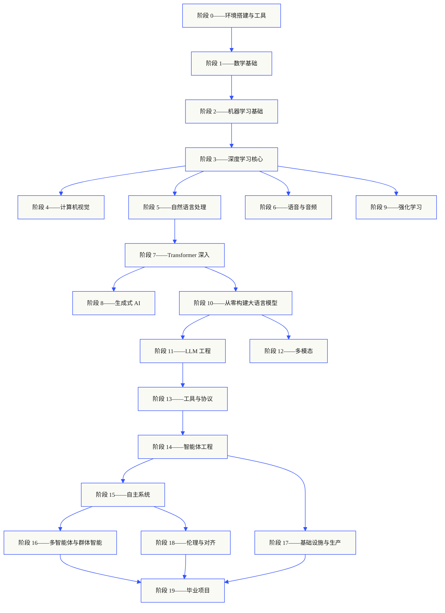
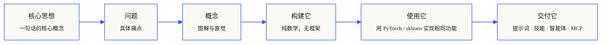

<p align="center">
  
</p>

<p align="center">
  <a href="https://github.com/rohitg00/ai-engineering-from-scratch/blob/main/LICENSE"></a>
  <a href="https://github.com/rohitg00/ai-engineering-from-scratch/blob/main/ROADMAP.md"></a>
  <a href="#contents"></a>
  <a href="https://github.com/rohitg00/ai-engineering-from-scratch/stargazers"></a>
  <a href="https://aiengineeringfromscratch.com"></a>
</p>

```
░░░▒▒▒░░░▒▒▒░░░▒▒▒░░░▒▒▒░░░▒▒▒░░░▒▒▒░░░▒▒▒░░░▒▒▒░░░▒▒▒░░░▒▒▒░░░▒▒▒░░░▒▒▒░░░▒▒▒░░░▒▒▒░░░▒▒▒
```

> **84% 的学生已经在使用 AI 工具，但只有 18% 的人觉得自己做好了专业使用的准备。** 本课程填补了这一差距。
>
> 435 节课。20 个阶段。约 320 小时。涵盖 Python、TypeScript、Rust、Julia。每节课都产出一个可复用的产物：一个提示词、一项技能、一个智能体、一个 MCP 服务器。免费、开源、MIT 许可证。
>
> 你不只是学习 AI，你亲手从零构建它，端到端。

## 运作方式

大多数 AI 教材都是零散地教授知识。这里一篇论文，那里一篇微调文章，某个地方又一个炫酷的智能体演示。这些碎片很难串联起来。你交付了一个聊天机器人，却无法解释它的损失曲线。你把一个函数挂接到智能体上，却说不出注意力机制在调用它的模型内部做了什么。

本课程是主线。20 个阶段，435 节课，四种语言：Python、TypeScript、Rust、Julia。从线性代数开始，到自主群体智能结束。每个算法都先从原始数学构建。反向传播、分词器、注意力机制、智能体循环。当 PyTorch 出现时，你已经知道它在底层做了什么。

每节课遵循相同的循环：阅读问题、推导数学、编写代码、运行测试、保留产物。没有五分钟的速成视频，没有复制粘贴式的部署，没有手把手教学。免费、开源，旨在你的个人笔记本上运行。

```
░░░▒▒▒░░░▒▒▒░░░▒▒▒░░░▒▒▒░░░▒▒▒░░░▒▒▒░░░▒▒▒░░░▒▒▒░░░▒▒▒░░░▒▒▒░░░▒▒▒░░░▒▒▒░░░▒▒▒░░░▒▒▒░░░▒▒▒
```

## 课程结构

二十个阶段层层递进。数学是地基，智能体与生产部署是屋顶。如果你已经掌握了底层内容，可以跳过去，但不要跳过后又疑惑为什么顶层的东西出问题了。



```
░░░▒▒▒░░░▒▒▒░░░▒▒▒░░░▒▒▒░░░▒▒▒░░░▒▒▒░░░▒▒▒░░░▒▒▒░░░▒▒▒░░░▒▒▒░░░▒▒▒░░░▒▒▒░░░▒▒▒░░░▒▒▒░░░▒▒▒
```

## 每节课的结构

每节课都在自己的文件夹中，整个课程采用统一的结构：

```
phases/<NN>-<phase-name>/<NN>-<lesson-name>/
├── code/      可运行的实现（Python、TypeScript、Rust、Julia）
├── docs/
│   └── en.md   课程讲义
└── outputs/   本节课产出的提示词、技能、智能体或 MCP 服务器
```

每节课遵循六个节拍。**构建它/使用它** 的划分是核心——你先从头实现算法，然后用生产级库运行同样的东西。你能理解框架在做什么，是因为你自己写了简化版。



## 入门指南

三种方式入门，任选其一。

**方案 A——阅读。** 在 [aiengineeringfromscratch.com](https://aiengineeringfromscratch.com) 上打开任何已完成的课程，或在[目录](#contents)下展开某个阶段。无需配置，无需克隆。

**方案 B——克隆并运行。**

```bash
git clone https://github.com/rohitg00/ai-engineering-from-scratch.git
cd ai-engineering-from-scratch
python phases/01-math-foundations/01-linear-algebra-intuition/code/vectors.py
```

**方案 C——找到你的水平（推荐）。** 智能跳过。在 Claude、Cursor、Codex、OpenClaw、Hermes 或任何安装了课程技能的智能体中：

```bash
/find-your-level
```

十个问题。将你的知识映射到起始阶段，构建包含时间估算的个性化学习路径。每完成一个阶段后：

```bash
/check-understanding 3        # 自测阶段 3
ls phases/03-deep-learning-core/05-loss-functions/outputs/
# ├── prompt-loss-function-selector.md
# └── prompt-loss-debugger.md
```

### 先决条件

- 你会写代码（任何语言；Python 会有帮助）。
- 你想理解 AI **实际是如何工作的**，而不仅仅是调用 API。

### 内置智能体技能（Claude、Cursor、Codex、OpenClaw、Hermes）

| 技能 | 功能 |
|---|---|
| [`/find-your-level`](https://github.com/rohitg00/ai-engineering-from-scratch/blob/main/.claude/skills/find-your-level/SKILL.md) | 十个问题的定位测验。将你的知识映射到起始阶段，生成包含时间估算的个性化学习路径。 |
| [`/check-understanding <phase>`](https://github.com/rohitg00/ai-engineering-from-scratch/blob/main/.claude/skills/check-understanding/SKILL.md) | 每个阶段的测验，八个问题，附有反馈和需要复习的具体课程。 |

```
░░░▒▒▒░░░▒▒▒░░░▒▒▒░░░▒▒▒░░░▒▒▒░░░▒▒▒░░░▒▒▒░░░▒▒▒░░░▒▒▒░░░▒▒▒░░░▒▒▒░░░▒▒▒░░░▒▒▒░░░▒▒▒░░░▒▒▒
```

## 每节课都有产出

其他课程结束时说"恭喜你，你学会了 X"。而这里的每节课都以一个**可复用工具**结束，你可以安装或粘贴到日常工作流中。

<table>
<tr>
<th align="left" width="25%"><br/><sub>FIG_001 · A</sub><br/><b>提示词</b></th>
<th align="left" width="25%"><br/><sub>FIG_001 · B</sub><br/><b>技能</b></th>
<th align="left" width="25%"><br/><sub>FIG_001 · C</sub><br/><b>智能体</b></th>
<th align="left" width="25%"><br/><sub>FIG_001 · D</sub><br/><b>MCP 服务器</b></th>
</tr>
<tr>
<td valign="top">粘贴到任何 AI 助手中，获得针对特定任务的专家级帮助。</td>
<td valign="top">放入 Claude、Cursor、Codex、OpenClaw、Hermes 或任何能读取 <code>SKILL.md</code> 的智能体中。</td>
<td valign="top">作为自主工作者部署——你在阶段 14 中亲手编写了循环逻辑。</td>
<td valign="top">插入任何兼容 MCP 的客户端。在阶段 13 中端到端构建。</td>
</tr>
</table>

> 使用 `python3 scripts/install_skills.py` 安装全部。真正的工具，不是作业。
> 课程结束时，你将拥有 435 个产物的作品集，而且你真正理解它们，因为是你亲手构建的。

### FIG_002 · 一个完整示例

阶段 14，第 1 课：智能体循环。约 120 行纯 Python，无依赖。

<table>
<tr>
<td valign="top" width="50%">

**`code/agent_loop.py`** &nbsp; <sub><i>构建它</i></sub>

```python
def run(query, tools):
    history = [user(query)]
    for step in range(MAX_STEPS):
        msg = llm(history)
        if msg.tool_calls:
            for call in msg.tool_calls:
                result = tools[call.name](**call.args)
                history.append(tool_result(call.id, result))
            continue
        return msg.content
    raise StepLimitExceeded
```

</td>
<td valign="top" width="50%">

**`outputs/skill-agent-loop.md`** &nbsp; <sub><i>交付它</i></sub>

```markdown
---
name: agent-loop
description: 适用于任何工具列表的 ReAct 风格循环
phase: 14
lesson: 01
---

实现一个最小的智能体循环，它...
```

**`outputs/prompt-debug-agent.md`**

```markdown
你是一个智能体调试器。给定一次智能体运行的轨迹，
识别智能体出错的步骤并解释原因...
```

</td>
</tr>
</table>

```
░░░▒▒▒░░░▒▒▒░░░▒▒▒░░░▒▒▒░░░▒▒▒░░░▒▒▒░░░▒▒▒░░░▒▒▒░░░▒▒▒░░░▒▒▒░░░▒▒▒░░░▒▒▒░░░▒▒▒░░░▒▒▒░░░▒▒▒
```

<a id="contents"></a>

## 目录

二十个阶段。点击任意阶段展开课程列表。

<a id="phase-0"></a>
### 阶段 0：环境搭建与工具 `12 节课`
> 为后续所有内容准备好你的环境。

| # | 课程 | 类型 | 语言 |
|:---:|--------|:----:|------|
| 01 | [开发环境](https://github.com/rohitg00/ai-engineering-from-scratch/blob/main/phases/00-setup-and-tooling/01-dev-environment/) | 构建 | Python、TypeScript、Rust |
| 02 | [Git 与协作](https://github.com/rohitg00/ai-engineering-from-scratch/blob/main/phases/00-setup-and-tooling/02-git-and-collaboration/) | 学习 | — |
| 03 | [GPU 配置与云端](https://github.com/rohitg00/ai-engineering-from-scratch/blob/main/phases/00-setup-and-tooling/03-gpu-setup-and-cloud/) | 构建 | Python |
| 04 | [API 与密钥](https://github.com/rohitg00/ai-engineering-from-scratch/blob/main/phases/00-setup-and-tooling/04-apis-and-keys/) | 构建 | Python、TypeScript |
| 05 | [Jupyter Notebooks](https://github.com/rohitg00/ai-engineering-from-scratch/blob/main/phases/00-setup-and-tooling/05-jupyter-notebooks/) | 构建 | Python |
| 06 | [Python 环境](https://github.com/rohitg00/ai-engineering-from-scratch/blob/main/phases/00-setup-and-tooling/06-python-environments/) | 构建 | Python |
| 07 | [面向 AI 的 Docker](https://github.com/rohitg00/ai-engineering-from-scratch/blob/main/phases/00-setup-and-tooling/07-docker-for-ai/) | 构建 | Python |
| 08 | [编辑器配置](https://github.com/rohitg00/ai-engineering-from-scratch/blob/main/phases/00-setup-and-tooling/08-editor-setup/) | 构建 | — |
| 09 | [数据管理](https://github.com/rohitg00/ai-engineering-from-scratch/blob/main/phases/00-setup-and-tooling/09-data-management/) | 构建 | Python |
| 10 | [终端与 Shell](https://github.com/rohitg00/ai-engineering-from-scratch/blob/main/phases/00-setup-and-tooling/10-terminal-and-shell/) | 学习 | — |
| 11 | [面向 AI 的 Linux](https://github.com/rohitg00/ai-engineering-from-scratch/blob/main/phases/00-setup-and-tooling/11-linux-for-ai/) | 学习 | — |
| 12 | [调试与性能分析](https://github.com/rohitg00/ai-engineering-from-scratch/blob/main/phases/00-setup-and-tooling/12-debugging-and-profiling/) | 构建 | Python |

<details id="phase-1">
<summary><b>阶段 1——数学基础</b> &nbsp;<code>22 节课</code>&nbsp; <em>通过代码理解每个 AI 算法背后的直觉。</em></summary>
<br/>

| # | 课程 | 类型 | 语言 |
|:---:|--------|:----:|------|
| 01 | [线性代数直觉](https://github.com/rohitg00/ai-engineering-from-scratch/blob/main/phases/01-math-foundations/01-linear-algebra-intuition/) | 学习 | Python、Julia |
| 02 | [向量、矩阵与运算](https://github.com/rohitg00/ai-engineering-from-scratch/blob/main/phases/01-math-foundations/02-vectors-matrices-operations/) | 构建 | Python、Julia |
| 03 | [矩阵变换与特征值](https://github.com/rohitg00/ai-engineering-from-scratch/blob/main/phases/01-math-foundations/03-matrix-transformations/) | 构建 | Python、Julia |
| 04 | [面向 ML 的微积分：导数与梯度](https://github.com/rohitg00/ai-engineering-from-scratch/blob/main/phases/01-math-foundations/04-calculus-for-ml/) | 学习 | Python |
| 05 | [链式法则与自动微分](https://github.com/rohitg00/ai-engineering-from-scratch/blob/main/phases/01-math-foundations/05-chain-rule-and-autodiff/) | 构建 | Python |
| 06 | [概率与分布](https://github.com/rohitg00/ai-engineering-from-scratch/blob/main/phases/01-math-foundations/06-probability-and-distributions/) | 学习 | Python |
| 07 | [贝叶斯定理与统计思维](https://github.com/rohitg00/ai-engineering-from-scratch/blob/main/phases/01-math-foundations/07-bayes-theorem/) | 构建 | Python |
| 08 | [优化：梯度下降家族](https://github.com/rohitg00/ai-engineering-from-scratch/blob/main/phases/01-math-foundations/08-optimization/) | 构建 | Python |
| 09 | [信息论：熵、KL 散度](https://github.com/rohitg00/ai-engineering-from-scratch/blob/main/phases/01-math-foundations/09-information-theory/) | 学习 | Python |
| 10 | [降维：PCA、t-SNE、UMAP](https://github.com/rohitg00/ai-engineering-from-scratch/blob/main/phases/01-math-foundations/10-dimensionality-reduction/) | 构建 | Python |
| 11 | [奇异值分解](https://github.com/rohitg00/ai-engineering-from-scratch/blob/main/phases/01-math-foundations/11-singular-value-decomposition/) | 构建 | Python、Julia |
| 12 | [张量运算](https://github.com/rohitg00/ai-engineering-from-scratch/blob/main/phases/01-math-foundations/12-tensor-operations/) | 构建 | Python |
| 13 | [数值稳定性](https://github.com/rohitg00/ai-engineering-from-scratch/blob/main/phases/01-math-foundations/13-numerical-stability/) | 构建 | Python |
| 14 | [范数与距离](https://github.com/rohitg00/ai-engineering-from-scratch/blob/main/phases/01-math-foundations/14-norms-and-distances/) | 构建 | Python |
| 15 | [面向 ML 的统计学](https://github.com/rohitg00/ai-engineering-from-scratch/blob/main/phases/01-math-foundations/15-statistics-for-ml/) | 构建 | Python |
| 16 | [采样方法](https://github.com/rohitg00/ai-engineering-from-scratch/blob/main/phases/01-math-foundations/16-sampling-methods/) | 构建 | Python |
| 17 | [线性系统](https://github.com/rohitg00/ai-engineering-from-scratch/blob/main/phases/01-math-foundations/17-linear-systems/) | 构建 | Python |
| 18 | [凸优化](https://github.com/rohitg00/ai-engineering-from-scratch/blob/main/phases/01-math-foundations/18-convex-optimization/) | 构建 | Python |
| 19 | [面向 AI 的复数](https://github.com/rohitg00/ai-engineering-from-scratch/blob/main/phases/01-math-foundations/19-complex-numbers/) | 学习 | Python |
| 20 | [傅里叶变换](https://github.com/rohitg00/ai-engineering-from-scratch/blob/main/phases/01-math-foundations/20-fourier-transform/) | 构建 | Python |
| 21 | [面向 ML 的图论](https://github.com/rohitg00/ai-engineering-from-scratch/blob/main/phases/01-math-foundations/21-graph-theory/) | 构建 | Python |
| 22 | [随机过程](https://github.com/rohitg00/ai-engineering-from-scratch/blob/main/phases/01-math-foundations/22-stochastic-processes/) | 学习 | Python |

</details>

<details id="phase-2">
<summary><b>阶段 2——机器学习基础</b> &nbsp;<code>18 节课</code>&nbsp; <em>经典 ML——仍然是大多数生产 AI 的支柱。</em></summary>
<br/>

| # | 课程 | 类型 | 语言 |
|:---:|--------|:----:|------|
| 01 | [什么是机器学习](https://github.com/rohitg00/ai-engineering-from-scratch/blob/main/phases/02-ml-fundamentals/01-what-is-machine-learning/) | 学习 | Python |
| 02 | [从零实现线性回归](https://github.com/rohitg00/ai-engineering-from-scratch/blob/main/phases/02-ml-fundamentals/02-linear-regression/) | 构建 | Python |
| 03 | [逻辑回归与分类](https://github.com/rohitg00/ai-engineering-from-scratch/blob/main/phases/02-ml-fundamentals/03-logistic-regression/) | 构建 | Python |
| 04 | [决策树与随机森林](https://github.com/rohitg00/ai-engineering-from-scratch/blob/main/phases/02-ml-fundamentals/04-decision-trees/) | 构建 | Python |
| 05 | [支持向量机](https://github.com/rohitg00/ai-engineering-from-scratch/blob/main/phases/02-ml-fundamentals/05-support-vector-machines/) | 构建 | Python |
| 06 | [KNN 与距离度量](https://github.com/rohitg00/ai-engineering-from-scratch/blob/main/phases/02-ml-fundamentals/06-knn-and-distances/) | 构建 | Python |
| 07 | [无监督学习：K-Means、DBSCAN](https://github.com/rohitg00/ai-engineering-from-scratch/blob/main/phases/02-ml-fundamentals/07-unsupervised-learning/) | 构建 | Python |
| 08 | [特征工程与选择](https://github.com/rohitg00/ai-engineering-from-scratch/blob/main/phases/02-ml-fundamentals/08-feature-engineering/) | 构建 | Python |
| 09 | [模型评估：指标、交叉验证](https://github.com/rohitg00/ai-engineering-from-scratch/blob/main/phases/02-ml-fundamentals/09-model-evaluation/) | 构建 | Python |
| 10 | [偏差、方差与学习曲线](https://github.com/rohitg00/ai-engineering-from-scratch/blob/main/phases/02-ml-fundamentals/10-bias-variance/) | 学习 | Python |
| 11 | [集成方法：Boosting、Bagging、Stacking](https://github.com/rohitg00/ai-engineering-from-scratch/blob/main/phases/02-ml-fundamentals/11-ensemble-methods/) | 构建 | Python |
| 12 | [超参数调优](https://github.com/rohitg00/ai-engineering-from-scratch/blob/main/phases/02-ml-fundamentals/12-hyperparameter-tuning/) | 构建 | Python |
| 13 | [ML 流水线与实验追踪](https://github.com/rohitg00/ai-engineering-from-scratch/blob/main/phases/02-ml-fundamentals/13-ml-pipelines/) | 构建 | Python |
| 14 | [朴素贝叶斯](https://github.com/rohitg00/ai-engineering-from-scratch/blob/main/phases/02-ml-fundamentals/14-naive-bayes/) | 构建 | Python |
| 15 | [时间序列基础](https://github.com/rohitg00/ai-engineering-from-scratch/blob/main/phases/02-ml-fundamentals/15-time-series/) | 构建 | Python |
| 16 | [异常检测](https://github.com/rohitg00/ai-engineering-from-scratch/blob/main/phases/02-ml-fundamentals/16-anomaly-detection/) | 构建 | Python |
| 17 | [处理不平衡数据](https://github.com/rohitg00/ai-engineering-from-scratch/blob/main/phases/02-ml-fundamentals/17-imbalanced-data/) | 构建 | Python |
| 18 | [特征选择](https://github.com/rohitg00/ai-engineering-from-scratch/blob/main/phases/02-ml-fundamentals/18-feature-selection/) | 构建 | Python |

</details>

<details id="phase-3">
<summary><b>阶段 3——深度学习核心</b> &nbsp;<code>13 节课</code>&nbsp; <em>从第一性原理构建神经网络。在你构建出框架之前，不使用任何框架。</em></summary>
<br/>

| # | 课程 | 类型 | 语言 |
|:---:|--------|:----:|------|
| 01 | [感知机：一切的起点](https://github.com/rohitg00/ai-engineering-from-scratch/blob/main/phases/03-deep-learning-core/01-the-perceptron/) | 构建 | Python |
| 02 | [多层网络与前向传播](https://github.com/rohitg00/ai-engineering-from-scratch/blob/main/phases/03-deep-learning-core/02-multi-layer-networks/) | 构建 | Python |
| 03 | [从零实现反向传播](https://github.com/rohitg00/ai-engineering-from-scratch/blob/main/phases/03-deep-learning-core/03-backpropagation/) | 构建 | Python |
| 04 | [激活函数：ReLU、Sigmoid、GELU 及其原理](https://github.com/rohitg00/ai-engineering-from-scratch/blob/main/phases/03-deep-learning-core/04-activation-functions/) | 构建 | Python |
| 05 | [损失函数：MSE、交叉熵、对比损失](https://github.com/rohitg00/ai-engineering-from-scratch/blob/main/phases/03-deep-learning-core/05-loss-functions/) | 构建 | Python |
| 06 | [优化器：SGD、Momentum、Adam、AdamW](https://github.com/rohitg00/ai-engineering-from-scratch/blob/main/phases/03-deep-learning-core/06-optimizers/) | 构建 | Python |
| 07 | [正则化：Dropout、权重衰减、BatchNorm](https://github.com/rohitg00/ai-engineering-from-scratch/blob/main/phases/03-deep-learning-core/07-regularization/) | 构建 | Python |
| 08 | [权重初始化与训练稳定性](https://github.com/rohitg00/ai-engineering-from-scratch/blob/main/phases/03-deep-learning-core/08-weight-initialization/) | 构建 | Python |
| 09 | [学习率调度与预热](https://github.com/rohitg00/ai-engineering-from-scratch/blob/main/phases/03-deep-learning-core/09-learning-rate-schedules/) | 构建 | Python |
| 10 | [构建你自己的迷你框架](https://github.com/rohitg00/ai-engineering-from-scratch/blob/main/phases/03-deep-learning-core/10-mini-framework/) | 构建 | Python |
| 11 | [PyTorch 入门](https://github.com/rohitg00/ai-engineering-from-scratch/blob/main/phases/03-deep-learning-core/11-intro-to-pytorch/) | 构建 | Python |
| 12 | [JAX 入门](https://github.com/rohitg00/ai-engineering-from-scratch/blob/main/phases/03-deep-learning-core/12-intro-to-jax/) | 构建 | Python |
| 13 | [调试神经网络](https://github.com/rohitg00/ai-engineering-from-scratch/blob/main/phases/03-deep-learning-core/13-debugging-neural-networks/) | 构建 | Python |

</details>

<details id="phase-4">
<summary><b>阶段 4——计算机视觉</b> &nbsp;<code>28 节课</code>&nbsp; <em>从像素到理解——图像、视频、3D、VLM 与世界模型。</em></summary>
<br/>

| # | 课程 | 类型 | 语言 |
|:---:|--------|:----:|------|
| 01 | [图像基础：像素、通道、色彩空间](https://github.com/rohitg00/ai-engineering-from-scratch/blob/main/phases/04-computer-vision/01-image-fundamentals/) | 学习 | Python |
| 02 | [从零实现卷积](https://github.com/rohitg00/ai-engineering-from-scratch/blob/main/phases/04-computer-vision/02-convolutions-from-scratch/) | 构建 | Python |
| 03 | [CNN：从 LeNet 到 ResNet](https://github.com/rohitg00/ai-engineering-from-scratch/blob/main/phases/04-computer-vision/03-cnns-lenet-to-resnet/) | 构建 | Python |
| 04 | [图像分类](https://github.com/rohitg00/ai-engineering-from-scratch/blob/main/phases/04-computer-vision/04-image-classification/) | 构建 | Python |
| 05 | [迁移学习与微调](https://github.com/rohitg00/ai-engineering-from-scratch/blob/main/phases/04-computer-vision/05-transfer-learning/) | 构建 | Python |
| 06 | [目标检测——从零实现 YOLO](https://github.com/rohitg00/ai-engineering-from-scratch/blob/main/phases/04-computer-vision/06-object-detection-yolo/) | 构建 | Python |
| 07 | [语义分割——U-Net](https://github.com/rohitg00/ai-engineering-from-scratch/blob/main/phases/04-computer-vision/07-semantic-segmentation-unet/) | 构建 | Python |
| 08 | [实例分割——Mask R-CNN](https://github.com/rohitg00/ai-engineering-from-scratch/blob/main/phases/04-computer-vision/08-instance-segmentation-mask-rcnn/) | 构建 | Python |
| 09 | [图像生成——GAN](https://github.com/rohitg00/ai-engineering-from-scratch/blob/main/phases/04-computer-vision/09-image-generation-gans/) | 构建 | Python |
| 10 | [图像生成——扩散模型](https://github.com/rohitg00/ai-engineering-from-scratch/blob/main/phases/04-computer-vision/10-image-generation-diffusion/) | 构建 | Python |
| 11 | [Stable Diffusion——架构与微调](https://github.com/rohitg00/ai-engineering-from-scratch/blob/main/phases/04-computer-vision/11-stable-diffusion/) | 构建 | Python |
| 12 | [视频理解——时序建模](https://github.com/rohitg00/ai-engineering-from-scratch/blob/main/phases/04-computer-vision/12-video-understanding/) | 构建 | Python |
| 13 | [3D 视觉：点云、NeRF](https://github.com/rohitg00/ai-engineering-from-scratch/blob/main/phases/04-computer-vision/13-3d-vision-nerf/) | 构建 | Python |
| 14 | [Vision Transformers (ViT)](https://github.com/rohitg00/ai-engineering-from-scratch/blob/main/phases/04-computer-vision/14-vision-transformers/) | 构建 | Python |
| 15 | [实时视觉：边缘部署](https://github.com/rohitg00/ai-engineering-from-scratch/blob/main/phases/04-computer-vision/15-real-time-edge/) | 构建 | Python、Rust |
| 16 | [构建完整的视觉流水线](https://github.com/rohitg00/ai-engineering-from-scratch/blob/main/phases/04-computer-vision/16-vision-pipeline-capstone/) | 构建 | Python |
| 17 | [自监督视觉——SimCLR、DINO、MAE](https://github.com/rohitg00/ai-engineering-from-scratch/blob/main/phases/04-computer-vision/17-self-supervised-vision/) | 构建 | Python |
| 18 | [开放词汇视觉——CLIP](https://github.com/rohitg00/ai-engineering-from-scratch/blob/main/phases/04-computer-vision/18-open-vocab-clip/) | 构建 | Python |
| 19 | [OCR 与文档理解](https://github.com/rohitg00/ai-engineering-from-scratch/blob/main/phases/04-computer-vision/19-ocr-document-understanding/) | 构建 | Python |
| 20 | [图像检索与度量学习](https://github.com/rohitg00/ai-engineering-from-scratch/blob/main/phases/04-computer-vision/20-image-retrieval-metric/) | 构建 | Python |
| 21 | [关键点检测与姿态估计](https://github.com/rohitg00/ai-engineering-from-scratch/blob/main/phases/04-computer-vision/21-keypoint-pose/) | 构建 | Python |
| 22 | [从零实现 3D 高斯泼溅](https://github.com/rohitg00/ai-engineering-from-scratch/blob/main/phases/04-computer-vision/22-3d-gaussian-splatting/) | 构建 | Python |
| 23 | [扩散 Transformer 与矫正流](https://github.com/rohitg00/ai-engineering-from-scratch/blob/main/phases/04-computer-vision/23-diffusion-transformers-rectified-flow/) | 构建 | Python |
| 24 | [SAM 3 与开放词汇分割](https://github.com/rohitg00/ai-engineering-from-scratch/blob/main/phases/04-computer-vision/24-sam3-open-vocab-segmentation/) | 构建 | Python |
| 25 | [视觉-语言模型 (ViT-MLP-LLM)](https://github.com/rohitg00/ai-engineering-from-scratch/blob/main/phases/04-computer-vision/25-vision-language-models/) | 构建 | Python |
| 26 | [单目深度与几何估计](https://github.com/rohitg00/ai-engineering-from-scratch/blob/main/phases/04-computer-vision/26-monocular-depth/) | 构建 | Python |
| 27 | [多目标跟踪与视频记忆](https://github.com/rohitg00/ai-engineering-from-scratch/blob/main/phases/04-computer-vision/27-multi-object-tracking/) | 构建 | Python |
| 28 | [世界模型与视频扩散](https://github.com/rohitg00/ai-engineering-from-scratch/blob/main/phases/04-computer-vision/28-world-models-video-diffusion/) | 构建 | Python |

</details>

<details id="phase-5">
<summary><b>阶段 5——NLP：从基础到高级</b> &nbsp;<code>29 节课</code>&nbsp; <em>语言是智能的接口。</em></summary>
<br/>

| # | 课程 | 类型 | 语言 |
|:---:|--------|:----:|------|
| 01 | [文本处理：分词、词干提取、词形还原](https://github.com/rohitg00/ai-engineering-from-scratch/blob/main/phases/05-nlp-foundations-to-advanced/01-text-processing/) | 构建 | Python |
| 02 | [词袋模型、TF-IDF 与文本表示](https://github.com/rohitg00/ai-engineering-from-scratch/blob/main/phases/05-nlp-foundations-to-advanced/02-bag-of-words-tfidf/) | 构建 | Python |
| 03 | [词嵌入：从零实现 Word2Vec](https://github.com/rohitg00/ai-engineering-from-scratch/blob/main/phases/05-nlp-foundations-to-advanced/03-word-embeddings-word2vec/) | 构建 | Python |
| 04 | [GloVe、FastText 与子词嵌入](https://github.com/rohitg00/ai-engineering-from-scratch/blob/main/phases/05-nlp-foundations-to-advanced/04-glove-fasttext-subword/) | 构建 | Python |
| 05 | [情感分析](https://github.com/rohitg00/ai-engineering-from-scratch/blob/main/phases/05-nlp-foundations-to-advanced/05-sentiment-analysis/) | 构建 | Python |
| 06 | [命名实体识别 (NER)](https://github.com/rohitg00/ai-engineering-from-scratch/blob/main/phases/05-nlp-foundations-to-advanced/06-named-entity-recognition/) | 构建 | Python |
| 07 | [词性标注与句法分析](https://github.com/rohitg00/ai-engineering-from-scratch/blob/main/phases/05-nlp-foundations-to-advanced/07-pos-tagging-parsing/) | 构建 | Python |
| 08 | [文本分类——用于文本的 CNN 与 RNN](https://github.com/rohitg00/ai-engineering-from-scratch/blob/main/phases/05-nlp-foundations-to-advanced/08-cnns-rnns-for-text/) | 构建 | Python |
| 09 | [序列到序列模型](https://github.com/rohitg00/ai-engineering-from-scratch/blob/main/phases/05-nlp-foundations-to-advanced/09-sequence-to-sequence/) | 构建 | Python |
| 10 | [注意力机制——突破性进展](https://github.com/rohitg00/ai-engineering-from-scratch/blob/main/phases/05-nlp-foundations-to-advanced/10-attention-mechanism/) | 构建 | Python |
| 11 | [机器翻译](https://github.com/rohitg00/ai-engineering-from-scratch/blob/main/phases/05-nlp-foundations-to-advanced/11-machine-translation/) | 构建 | Python |
| 12 | [文本摘要](https://github.com/rohitg00/ai-engineering-from-scratch/blob/main/phases/05-nlp-foundations-to-advanced/12-text-summarization/) | 构建 | Python |
| 13 | [问答系统](https://github.com/rohitg00/ai-engineering-from-scratch/blob/main/phases/05-nlp-foundations-to-advanced/13-question-answering/) | 构建 | Python |
| 14 | [信息检索与搜索](https://github.com/rohitg00/ai-engineering-from-scratch/blob/main/phases/05-nlp-foundations-to-advanced/14-information-retrieval-search/) | 构建 | Python |
| 15 | [主题建模：LDA、BERTopic](https://github.com/rohitg00/ai-engineering-from-scratch/blob/main/phases/05-nlp-foundations-to-advanced/15-topic-modeling/) | 构建 | Python |
| 16 | [文本生成](https://github.com/rohitg00/ai-engineering-from-scratch/blob/main/phases/05-nlp-foundations-to-advanced/16-text-generation-pre-transformer/) | 构建 | Python |
| 17 | [聊天机器人：从基于规则到神经网络](https://github.com/rohitg00/ai-engineering-from-scratch/blob/main/phases/05-nlp-foundations-to-advanced/17-chatbots-rule-to-neural/) | 构建 | Python |
| 18 | [多语言 NLP](https://github.com/rohitg00/ai-engineering-from-scratch/blob/main/phases/05-nlp-foundations-to-advanced/18-multilingual-nlp/) | 构建 | Python |
| 19 | [子词分词：BPE、WordPiece、Unigram、SentencePiece](https://github.com/rohitg00/ai-engineering-from-scratch/blob/main/phases/05-nlp-foundations-to-advanced/19-subword-tokenization/) | 学习 | Python |
| 20 | [结构化输出与约束解码](https://github.com/rohitg00/ai-engineering-from-scratch/blob/main/phases/05-nlp-foundations-to-advanced/20-structured-outputs-constrained-decoding/) | 构建 | Python |
| 21 | [自然语言推理与文本蕴含](https://github.com/rohitg00/ai-engineering-from-scratch/blob/main/phases/05-nlp-foundations-to-advanced/21-nli-textual-entailment/) | 学习 | Python |
| 22 | [嵌入模型深入](https://github.com/rohitg00/ai-engineering-from-scratch/blob/main/phases/05-nlp-foundations-to-advanced/22-embedding-models-deep-dive/) | 学习 | Python |
| 23 | [RAG 的分块策略](https://github.com/rohitg00/ai-engineering-from-scratch/blob/main/phases/05-nlp-foundations-to-advanced/23-chunking-strategies-rag/) | 构建 | Python |
| 24 | [指代消解](https://github.com/rohitg00/ai-engineering-from-scratch/blob/main/phases/05-nlp-foundations-to-advanced/24-coreference-resolution/) | 学习 | Python |
| 25 | [实体链接与消歧](https://github.com/rohitg00/ai-engineering-from-scratch/blob/main/phases/05-nlp-foundations-to-advanced/25-entity-linking/) | 构建 | Python |
| 26 | [关系抽取与知识图谱构建](https://github.com/rohitg00/ai-engineering-from-scratch/blob/main/phases/05-nlp-foundations-to-advanced/26-relation-extraction-kg/) | 构建 | Python |
| 27 | [LLM 评估：RAGAS、DeepEval、G-Eval](https://github.com/rohitg00/ai-engineering-from-scratch/blob/main/phases/05-nlp-foundations-to-advanced/27-llm-evaluation-frameworks/) | 构建 | Python |
| 28 | [长上下文评估：NIAH、RULER、LongBench、MRCR](https://github.com/rohitg00/ai-engineering-from-scratch/blob/main/phases/05-nlp-foundations-to-advanced/28-long-context-evaluation/) | 学习 | Python |
| 29 | [对话状态追踪](https://github.com/rohitg00/ai-engineering-from-scratch/blob/main/phases/05-nlp-foundations-to-advanced/29-dialogue-state-tracking/) | 构建 | Python |

</details>

<details id="phase-6">
<summary><b>阶段 6——语音与音频</b> &nbsp;<code>17 节课</code>&nbsp; <em>听、理解、说话。</em></summary>
<br/>

| # | 课程 | 类型 | 语言 |
|:---:|--------|:----:|------|
| 01 | [音频基础：波形、采样、FFT](https://github.com/rohitg00/ai-engineering-from-scratch/blob/main/phases/06-speech-and-audio/01-audio-fundamentals) | 学习 | Python |
| 02 | [频谱图、梅尔尺度与音频特征](https://github.com/rohitg00/ai-engineering-from-scratch/blob/main/phases/06-speech-and-audio/02-spectrograms-mel-features) | 构建 | Python |
| 03 | [音频分类](https://github.com/rohitg00/ai-engineering-from-scratch/blob/main/phases/06-speech-and-audio/03-audio-classification) | 构建 | Python |
| 04 | [语音识别 (ASR)](https://github.com/rohitg00/ai-engineering-from-scratch/blob/main/phases/06-speech-and-audio/04-speech-recognition-asr) | 构建 | Python |
| 05 | [Whisper：架构与微调](https://github.com/rohitg00/ai-engineering-from-scratch/blob/main/phases/06-speech-and-audio/05-whisper-architecture-finetuning) | 构建 | Python |
| 06 | [说话人识别与验证](https://github.com/rohitg00/ai-engineering-from-scratch/blob/main/phases/06-speech-and-audio/06-speaker-recognition-verification) | 构建 | Python |
| 07 | [文本转语音 (TTS)](https://github.com/rohitg00/ai-engineering-from-scratch/blob/main/phases/06-speech-and-audio/07-text-to-speech) | 构建 | Python |
| 08 | [语音克隆与语音转换](https://github.com/rohitg00/ai-engineering-from-scratch/blob/main/phases/06-speech-and-audio/08-voice-cloning-conversion) | 构建 | Python |
| 09 | [音乐生成](https://github.com/rohitg00/ai-engineering-from-scratch/blob/main/phases/06-speech-and-audio/09-music-generation) | 构建 | Python |
| 10 | [音频-语言模型](https://github.com/rohitg00/ai-engineering-from-scratch/blob/main/phases/06-speech-and-audio/10-audio-language-models) | 构建 | Python |
| 11 | [实时音频处理](https://github.com/rohitg00/ai-engineering-from-scratch/blob/main/phases/06-speech-and-audio/11-real-time-audio-processing) | 构建 | Python、Rust |
| 12 | [构建语音助手流水线](https://github.com/rohitg00/ai-engineering-from-scratch/blob/main/phases/06-speech-and-audio/12-voice-assistant-pipeline) | 构建 | Python |
| 13 | [神经音频编解码器——EnCodec、SNAC、Mimi、DAC](https://github.com/rohitg00/ai-engineering-from-scratch/blob/main/phases/06-speech-and-audio/13-neural-audio-codecs) | 学习 | Python |
| 14 | [语音活动检测与话轮转换](https://github.com/rohitg00/ai-engineering-from-scratch/blob/main/phases/06-speech-and-audio/14-voice-activity-detection-turn-taking) | 构建 | Python |
| 15 | [流式语音到语音——Moshi、Hibiki](https://github.com/rohitg00/ai-engineering-from-scratch/blob/main/phases/06-speech-and-audio/15-streaming-speech-to-speech-moshi-hibiki) | 学习 | Python |
| 16 | [语音反欺骗与音频水印](https://github.com/rohitg00/ai-engineering-from-scratch/blob/main/phases/06-speech-and-audio/16-anti-spoofing-audio-watermarking) | 构建 | Python |
| 17 | [音频评估——WER、MOS、MMAU、排行榜](https://github.com/rohitg00/ai-engineering-from-scratch/blob/main/phases/06-speech-and-audio/17-audio-evaluation-metrics) | 学习 | Python |

</details>

<details id="phase-7">
<summary><b>阶段 7——Transformer 深入</b> &nbsp;<code>14 节课</code>&nbsp; <em>改变一切的架构。</em></summary>
<br/>

| # | 课程 | 类型 | 语言 |
|:---:|--------|:----:|------|
| 01 | [为什么是 Transformer：RNN 的问题](https://github.com/rohitg00/ai-engineering-from-scratch/blob/main/phases/07-transformers-deep-dive/01-why-transformers/) | 学习 | Python |
| 02 | [从零实现自注意力](https://github.com/rohitg00/ai-engineering-from-scratch/blob/main/phases/07-transformers-deep-dive/02-self-attention-from-scratch/) | 构建 | Python |
| 03 | [多头注意力](https://github.com/rohitg00/ai-engineering-from-scratch/blob/main/phases/07-transformers-deep-dive/03-multi-head-attention/) | 构建 | Python |
| 04 | [位置编码：正弦、RoPE、ALiBi](https://github.com/rohitg00/ai-engineering-from-scratch/blob/main/phases/07-transformers-deep-dive/04-positional-encoding/) | 构建 | Python |
| 05 | [完整 Transformer：编码器 + 解码器](https://github.com/rohitg00/ai-engineering-from-scratch/blob/main/phases/07-transformers-deep-dive/05-full-transformer/) | 构建 | Python |
| 06 | [BERT——掩码语言建模](https://github.com/rohitg00/ai-engineering-from-scratch/blob/main/phases/07-transformers-deep-dive/06-bert-masked-language-modeling/) | 构建 | Python |
| 07 | [GPT——因果语言建模](https://github.com/rohitg00/ai-engineering-from-scratch/blob/main/phases/07-transformers-deep-dive/07-gpt-causal-language-modeling/) | 构建 | Python |
| 08 | [T5、BART——编码器-解码器模型](https://github.com/rohitg00/ai-engineering-from-scratch/blob/main/phases/07-transformers-deep-dive/08-t5-bart-encoder-decoder/) | 学习 | Python |
| 09 | [Vision Transformers (ViT)](https://github.com/rohitg00/ai-engineering-from-scratch/blob/main/phases/07-transformers-deep-dive/09-vision-transformers/) | 构建 | Python |
| 10 | [音频 Transformer——Whisper 架构](https://github.com/rohitg00/ai-engineering-from-scratch/blob/main/phases/07-transformers-deep-dive/10-audio-transformers-whisper/) | 学习 | Python |
| 11 | [混合专家 (MoE)](https://github.com/rohitg00/ai-engineering-from-scratch/blob/main/phases/07-transformers-deep-dive/11-mixture-of-experts/) | 构建 | Python |
| 12 | [KV 缓存、Flash Attention 与推理优化](https://github.com/rohitg00/ai-engineering-from-scratch/blob/main/phases/07-transformers-deep-dive/12-kv-cache-flash-attention/) | 构建 | Python |
| 13 | [缩放定律](https://github.com/rohitg00/ai-engineering-from-scratch/blob/main/phases/07-transformers-deep-dive/13-scaling-laws/) | 学习 | Python |
| 14 | [从零构建一个 Transformer](https://github.com/rohitg00/ai-engineering-from-scratch/blob/main/phases/07-transformers-deep-dive/14-build-a-transformer-capstone/) | 构建 | Python |

</details>

<details id="phase-8">
<summary><b>阶段 8——生成式 AI</b> &nbsp;<code>14 节课</code>&nbsp; <em>创建图像、视频、音频、3D 及更多。</em></summary>
<br/>

| # | 课程 | 类型 | 语言 |
|:---:|--------|:----:|------|
| 01 | [生成模型：分类与历史](https://github.com/rohitg00/ai-engineering-from-scratch/blob/main/phases/08-generative-ai/01-generative-models-taxonomy-history/) | 学习 | Python |
| 02 | [自编码器与 VAE](https://github.com/rohitg00/ai-engineering-from-scratch/blob/main/phases/08-generative-ai/02-autoencoders-vae/) | 构建 | Python |
| 03 | [GAN：生成器 vs 判别器](https://github.com/rohitg00/ai-engineering-from-scratch/blob/main/phases/08-generative-ai/03-gans-generator-discriminator/) | 构建 | Python |
| 04 | [条件 GAN 与 Pix2Pix](https://github.com/rohitg00/ai-engineering-from-scratch/blob/main/phases/08-generative-ai/04-conditional-gans-pix2pix/) | 构建 | Python |
| 05 | [StyleGAN](https://github.com/rohitg00/ai-engineering-from-scratch/blob/main/phases/08-generative-ai/05-stylegan/) | 构建 | Python |
| 06 | [扩散模型——从零实现 DDPM](https://github.com/rohitg00/ai-engineering-from-scratch/blob/main/phases/08-generative-ai/06-diffusion-ddpm-from-scratch/) | 构建 | Python |
| 07 | [潜在扩散与 Stable Diffusion](https://github.com/rohitg00/ai-engineering-from-scratch/blob/main/phases/08-generative-ai/07-latent-diffusion-stable-diffusion/) | 构建 | Python |
| 08 | [ControlNet、LoRA 与条件控制](https://github.com/rohitg00/ai-engineering-from-scratch/blob/main/phases/08-generative-ai/08-controlnet-lora-conditioning/) | 构建 | Python |
| 09 | [图像修复、扩展与编辑](https://github.com/rohitg00/ai-engineering-from-scratch/blob/main/phases/08-generative-ai/09-inpainting-outpainting-editing/) | 构建 | Python |
| 10 | [视频生成](https://github.com/rohitg00/ai-engineering-from-scratch/blob/main/phases/08-generative-ai/10-video-generation/) | 构建 | Python |
| 11 | [音频生成](https://github.com/rohitg00/ai-engineering-from-scratch/blob/main/phases/08-generative-ai/11-audio-generation/) | 构建 | Python |
| 12 | [3D 生成](https://github.com/rohitg00/ai-engineering-from-scratch/blob/main/phases/08-generative-ai/12-3d-generation/) | 构建 | Python |
| 13 | [流匹配与矫正流](https://github.com/rohitg00/ai-engineering-from-scratch/blob/main/phases/08-generative-ai/13-flow-matching-rectified-flows/) | 构建 | Python |
| 14 | [评估：FID、CLIP Score](https://github.com/rohitg00/ai-engineering-from-scratch/blob/main/phases/08-generative-ai/14-evaluation-fid-clip-score/) | 构建 | Python |

</details>

<details id="phase-9">
<summary><b>阶段 9——强化学习</b> &nbsp;<code>12 节课</code>&nbsp; <em>RLHF 和游戏 AI 的基础。</em></summary>
<br/>

| # | 课程 | 类型 | 语言 |
|:---:|--------|:----:|------|
| 01 | [MDP、状态、动作与奖励](https://github.com/rohitg00/ai-engineering-from-scratch/blob/main/phases/09-reinforcement-learning/01-mdps-states-actions-rewards/) | 学习 | Python |
| 02 | [动态规划](https://github.com/rohitg00/ai-engineering-from-scratch/blob/main/phases/09-reinforcement-learning/02-dynamic-programming/) | 构建 | Python |
| 03 | [蒙特卡洛方法](https://github.com/rohitg00/ai-engineering-from-scratch/blob/main/phases/09-reinforcement-learning/03-monte-carlo-methods/) | 构建 | Python |
| 04 | [Q-Learning、SARSA](https://github.com/rohitg00/ai-engineering-from-scratch/blob/main/phases/09-reinforcement-learning/04-q-learning-sarsa/) | 构建 | Python |
| 05 | [深度 Q 网络 (DQN)](https://github.com/rohitg00/ai-engineering-from-scratch/blob/main/phases/09-reinforcement-learning/05-dqn/) | 构建 | Python |
| 06 | [策略梯度——REINFORCE](https://github.com/rohitg00/ai-engineering-from-scratch/blob/main/phases/09-reinforcement-learning/06-policy-gradients-reinforce/) | 构建 | Python |
| 07 | [Actor-Critic——A2C、A3C](https://github.com/rohitg00/ai-engineering-from-scratch/blob/main/phases/09-reinforcement-learning/07-actor-critic-a2c-a3c/) | 构建 | Python |
| 08 | [PPO](https://github.com/rohitg00/ai-engineering-from-scratch/blob/main/phases/09-reinforcement-learning/08-ppo/) | 构建 | Python |
| 09 | [奖励建模与 RLHF](https://github.com/rohitg00/ai-engineering-from-scratch/blob/main/phases/09-reinforcement-learning/09-reward-modeling-rlhf/) | 构建 | Python |
| 10 | [多智能体 RL](https://github.com/rohitg00/ai-engineering-from-scratch/blob/main/phases/09-reinforcement-learning/10-multi-agent-rl/) | 构建 | Python |
| 11 | [仿真到现实迁移](https://github.com/rohitg00/ai-engineering-from-scratch/blob/main/phases/09-reinforcement-learning/11-sim-to-real-transfer/) | 构建 | Python |
| 12 | [用于游戏的 RL](https://github.com/rohitg00/ai-engineering-from-scratch/blob/main/phases/09-reinforcement-learning/12-rl-for-games/) | 构建 | Python |

</details>

<details id="phase-10">
<summary><b>阶段 10——从零构建大语言模型</b> &nbsp;<code>22 节课</code>&nbsp; <em>构建、训练并理解大型语言模型。</em></summary>
<br/>

| # | 课程 | 类型 | 语言 |
|:---:|--------|:----:|------|
| 01 | [分词器：BPE、WordPiece、SentencePiece](https://github.com/rohitg00/ai-engineering-from-scratch/blob/main/phases/10-llms-from-scratch/01-tokenizers/) | 构建 | Python |
| 02 | [从零构建分词器](https://github.com/rohitg00/ai-engineering-from-scratch/blob/main/phases/10-llms-from-scratch/02-building-a-tokenizer/) | 构建 | Python |
| 03 | [预训练的数据流水线](https://github.com/rohitg00/ai-engineering-from-scratch/blob/main/phases/10-llms-from-scratch/03-data-pipelines/) | 构建 | Python |
| 04 | [预训练一个 Mini GPT (124M)](https://github.com/rohitg00/ai-engineering-from-scratch/blob/main/phases/10-llms-from-scratch/04-pre-training-mini-gpt/) | 构建 | Python |
| 05 | [分布式训练、FSDP、DeepSpeed](https://github.com/rohitg00/ai-engineering-from-scratch/blob/main/phases/10-llms-from-scratch/05-scaling-distributed/) | 构建 | Python |
| 06 | [指令微调——SFT](https://github.com/rohitg00/ai-engineering-from-scratch/blob/main/phases/10-llms-from-scratch/06-instruction-tuning-sft/) | 构建 | Python |
| 07 | [RLHF——奖励模型 + PPO](https://github.com/rohitg00/ai-engineering-from-scratch/blob/main/phases/10-llms-from-scratch/07-rlhf/) | 构建 | Python |
| 08 | [DPO——直接偏好优化](https://github.com/rohitg00/ai-engineering-from-scratch/blob/main/phases/10-llms-from-scratch/08-dpo/) | 构建 | Python |
| 09 | [宪法 AI 与自我改进](https://github.com/rohitg00/ai-engineering-from-scratch/blob/main/phases/10-llms-from-scratch/09-constitutional-ai-self-improvement/) | 构建 | Python |
| 10 | [评估——基准测试、Evals](https://github.com/rohitg00/ai-engineering-from-scratch/blob/main/phases/10-llms-from-scratch/10-evaluation/) | 构建 | Python |
| 11 | [量化：INT8、GPTQ、AWQ、GGUF](https://github.com/rohitg00/ai-engineering-from-scratch/blob/main/phases/10-llms-from-scratch/11-quantization/) | 构建 | Python、Rust |
| 12 | [推理优化](https://github.com/rohitg00/ai-engineering-from-scratch/blob/main/phases/10-llms-from-scratch/12-inference-optimization/) | 构建 | Python |
| 13 | [构建完整的 LLM 流水线](https://github.com/rohitg00/ai-engineering-from-scratch/blob/main/phases/10-llms-from-scratch/13-building-complete-llm-pipeline/) | 构建 | Python |
| 14 | [开放模型：架构走读](https://github.com/rohitg00/ai-engineering-from-scratch/blob/main/phases/10-llms-from-scratch/14-open-models-architecture-walkthroughs/) | 学习 | Python |
| 15 | [推测解码与 EAGLE-3](https://github.com/rohitg00/ai-engineering-from-scratch/blob/main/phases/10-llms-from-scratch/15-speculative-decoding-eagle3/) | 构建 | Python |
| 16 | [差分注意力 (V2)](https://github.com/rohitg00/ai-engineering-from-scratch/blob/main/phases/10-llms-from-scratch/16-differential-attention-v2/) | 构建 | Python |
| 17 | [原生稀疏注意力 (DeepSeek NSA)](https://github.com/rohitg00/ai-engineering-from-scratch/blob/main/phases/10-llms-from-scratch/17-native-sparse-attention/) | 构建 | Python |
| 18 | [多 Token 预测 (MTP)](https://github.com/rohitg00/ai-engineering-from-scratch/blob/main/phases/10-llms-from-scratch/18-multi-token-prediction/) | 构建 | Python |
| 19 | [DualPipe 并行](https://github.com/rohitg00/ai-engineering-from-scratch/blob/main/phases/10-llms-from-scratch/19-dualpipe-parallelism/) | 学习 | Python |
| 20 | [DeepSeek-V3 架构走读](https://github.com/rohitg00/ai-engineering-from-scratch/blob/main/phases/10-llms-from-scratch/20-deepseek-v3-walkthrough/) | 学习 | Python |
| 21 | [Jamba——混合 SSM-Transformer](https://github.com/rohitg00/ai-engineering-from-scratch/blob/main/phases/10-llms-from-scratch/21-jamba-hybrid-ssm-transformer/) | 学习 | Python |
| 22 | [异步与 Hogwild! 推理](https://github.com/rohitg00/ai-engineering-from-scratch/blob/main/phases/10-llms-from-scratch/22-async-hogwild-inference/) | 构建 | Python |

</details>

<details id="phase-11">
<summary><b>阶段 11——LLM 工程</b> &nbsp;<code>17 节课</code>&nbsp; <em>将 LLM 投入生产使用。</em></summary>
<br/>

| # | 课程 | 类型 | 语言 |
|:---:|--------|:----:|------|
| 01 | [提示工程：技巧与模式](https://github.com/rohitg00/ai-engineering-from-scratch/blob/main/phases/11-llm-engineering/01-prompt-engineering/) | 构建 | Python |
| 02 | [Few-Shot、CoT、思维树](https://github.com/rohitg00/ai-engineering-from-scratch/blob/main/phases/11-llm-engineering/02-few-shot-cot/) | 构建 | Python |
| 03 | [结构化输出](https://github.com/rohitg00/ai-engineering-from-scratch/blob/main/phases/11-llm-engineering/03-structured-outputs/) | 构建 | Python、TypeScript |
| 04 | [嵌入与向量表示](https://github.com/rohitg00/ai-engineering-from-scratch/blob/main/phases/11-llm-engineering/04-embeddings/) | 构建 | Python |
| 05 | [上下文工程](https://github.com/rohitg00/ai-engineering-from-scratch/blob/main/phases/11-llm-engineering/05-context-engineering/) | 构建 | Python、TypeScript |
| 06 | [RAG：检索增强生成](https://github.com/rohitg00/ai-engineering-from-scratch/blob/main/phases/11-llm-engineering/06-rag/) | 构建 | Python、TypeScript |
| 07 | [高级 RAG：分块、重排序](https://github.com/rohitg00/ai-engineering-from-scratch/blob/main/phases/11-llm-engineering/07-advanced-rag/) | 构建 | Python |
| 08 | [使用 LoRA 与 QLoRA 微调](https://github.com/rohitg00/ai-engineering-from-scratch/blob/main/phases/11-llm-engineering/08-fine-tuning-lora/) | 构建 | Python |
| 09 | [函数调用与工具使用](https://github.com/rohitg00/ai-engineering-from-scratch/blob/main/phases/11-llm-engineering/09-function-calling/) | 构建 | Python |
| 10 | [评估与测试](https://github.com/rohitg00/ai-engineering-from-scratch/blob/main/phases/11-llm-engineering/10-evaluation/) | 构建 | Python |
| 11 | [缓存、速率限制与成本](https://github.com/rohitg00/ai-engineering-from-scratch/blob/main/phases/11-llm-engineering/11-caching-cost/) | 构建 | Python |
| 12 | [护栏与安全](https://github.com/rohitg00/ai-engineering-from-scratch/blob/main/phases/11-llm-engineering/12-guardrails/) | 构建 | Python |
| 13 | [构建生产级 LLM 应用](https://github.com/rohitg00/ai-engineering-from-scratch/blob/main/phases/11-llm-engineering/13-production-app/) | 构建 | Python |
| 14 | [模型上下文协议 (MCP)](https://github.com/rohitg00/ai-engineering-from-scratch/blob/main/phases/11-llm-engineering/14-model-context-protocol/) | 构建 | Python |
| 15 | [提示缓存与上下文缓存](https://github.com/rohitg00/ai-engineering-from-scratch/blob/main/phases/11-llm-engineering/15-prompt-caching/) | 构建 | Python |
| 16 | [LangGraph：用于智能体的状态机](https://github.com/rohitg00/ai-engineering-from-scratch/blob/main/phases/11-llm-engineering/16-langgraph-state-machines/) | 构建 | Python |
| 17 | [智能体框架权衡](https://github.com/rohitg00/ai-engineering-from-scratch/blob/main/phases/11-llm-engineering/17-agent-framework-tradeoffs/) | 学习 | Python |

</details>

<details id="phase-12">
<summary><b>阶段 12——多模态 AI</b> &nbsp;<code>25 节课</code>&nbsp; <em>跨模态看、听、读和推理——从 ViT 补丁到计算机使用智能体。</em></summary>
<br/>

| # | 课程 | 类型 | 语言 |
|:---:|--------|:----:|------|
| 01 | [Vision Transformers 与补丁-Token 原语](https://github.com/rohitg00/ai-engineering-from-scratch/blob/main/phases/12-multimodal-ai/01-vision-transformer-patch-tokens/) | 学习 | Python |
| 02 | [CLIP 与对比视觉-语言预训练](https://github.com/rohitg00/ai-engineering-from-scratch/blob/main/phases/12-multimodal-ai/02-clip-contrastive-pretraining/) | 构建 | Python |
| 03 | [BLIP-2 Q-Former 作为模态桥梁](https://github.com/rohitg00/ai-engineering-from-scratch/blob/main/phases/12-multimodal-ai/03-blip2-qformer-bridge/) | 构建 | Python |
| 04 | [Flamingo 与门控交叉注意力](https://github.com/rohitg00/ai-engineering-from-scratch/blob/main/phases/12-multimodal-ai/04-flamingo-gated-cross-attention/) | 学习 | Python |
| 05 | [LLaVA 与视觉指令微调](https://github.com/rohitg00/ai-engineering-from-scratch/blob/main/phases/12-multimodal-ai/05-llava-visual-instruction-tuning/) | 构建 | Python |
| 06 | [任意分辨率视觉——Patch-n'-Pack 与 NaFlex](https://github.com/rohitg00/ai-engineering-from-scratch/blob/main/phases/12-multimodal-ai/06-any-resolution-patch-n-pack/) | 构建 | Python |
| 07 | [开放权重 VLM 配方：真正重要的东西](https://github.com/rohitg00/ai-engineering-from-scratch/blob/main/phases/12-multimodal-ai/07-open-weight-vlm-recipes/) | 学习 | Python |
| 08 | [LLaVA-OneVision：单图、多图、视频](https://github.com/rohitg00/ai-engineering-from-scratch/blob/main/phases/12-multimodal-ai/08-llava-onevision-single-multi-video/) | 构建 | Python |
| 09 | [Qwen-VL 家族与动态 FPS 视频](https://github.com/rohitg00/ai-engineering-from-scratch/blob/main/phases/12-multimodal-ai/09-qwen-vl-family-dynamic-fps/) | 学习 | Python |
| 10 | [InternVL3 原生多模态预训练](https://github.com/rohitg00/ai-engineering-from-scratch/blob/main/phases/12-multimodal-ai/10-internvl3-native-multimodal/) | 学习 | Python |
| 11 | [Chameleon 早期融合 Token-Only](https://github.com/rohitg00/ai-engineering-from-scratch/blob/main/phases/12-multimodal-ai/11-chameleon-early-fusion-tokens/) | 构建 | Python |
| 12 | [Emu3 用于生成的下一 Token 预测](https://github.com/rohitg00/ai-engineering-from-scratch/blob/main/phases/12-multimodal-ai/12-emu3-next-token-for-generation/) | 学习 | Python |
| 13 | [Transfusion 自回归 + 扩散](https://github.com/rohitg00/ai-engineering-from-scratch/blob/main/phases/12-multimodal-ai/13-transfusion-autoregressive-diffusion/) | 构建 | Python |
| 14 | [Show-o 离散扩散统一](https://github.com/rohitg00/ai-engineering-from-scratch/blob/main/phases/12-multimodal-ai/14-show-o-discrete-diffusion-unified/) | 学习 | Python |
| 15 | [Janus-Pro 解耦编码器](https://github.com/rohitg00/ai-engineering-from-scratch/blob/main/phases/12-multimodal-ai/15-janus-pro-decoupled-encoders/) | 构建 | Python |
| 16 | [MIO 任意到任意流式](https://github.com/rohitg00/ai-engineering-from-scratch/blob/main/phases/12-multimodal-ai/16-mio-any-to-any-streaming/) | 学习 | Python |
| 17 | [视频-语言时序定位](https://github.com/rohitg00/ai-engineering-from-scratch/blob/main/phases/12-multimodal-ai/17-video-language-temporal-grounding/) | 构建 | Python |
| 18 | [百万 Token 上下文的长视频](https://github.com/rohitg00/ai-engineering-from-scratch/blob/main/phases/12-multimodal-ai/18-long-video-million-token/) | 构建 | Python |
| 19 | [音频-语言模型：从 Whisper 到 AF3](https://github.com/rohitg00/ai-engineering-from-scratch/blob/main/phases/12-multimodal-ai/19-audio-language-whisper-to-af3/) | 构建 | Python |
| 20 | [全模态模型：Thinker-Talker 流式](https://github.com/rohitg00/ai-engineering-from-scratch/blob/main/phases/12-multimodal-ai/20-omni-models-thinker-talker/) | 构建 | Python |
| 21 | [具身 VLA：RT-2、OpenVLA、π0、GR00T](https://github.com/rohitg00/ai-engineering-from-scratch/blob/main/phases/12-multimodal-ai/21-embodied-vlas-openvla-pi0-groot/) | 学习 | Python |
| 22 | [文档与图表理解](https://github.com/rohitg00/ai-engineering-from-scratch/blob/main/phases/12-multimodal-ai/22-document-diagram-understanding/) | 构建 | Python |
| 23 | [ColPali 视觉原生文档 RAG](https://github.com/rohitg00/ai-engineering-from-scratch/blob/main/phases/12-multimodal-ai/23-colpali-vision-native-rag/) | 构建 | Python |
| 24 | [多模态 RAG 与跨模态检索](https://github.com/rohitg00/ai-engineering-from-scratch/blob/main/phases/12-multimodal-ai/24-multimodal-rag-cross-modal/) | 构建 | Python |
| 25 | [多模态智能体与计算机使用（毕业项目）](https://github.com/rohitg00/ai-engineering-from-scratch/blob/main/phases/12-multimodal-ai/25-multimodal-agents-computer-use/) | 构建 | Python |

</details>

<details id="phase-13">
<summary><b>阶段 13——工具与协议</b> &nbsp;<code>23 节课</code>&nbsp; <em>AI 与真实世界之间的接口。</em></summary>
<br/>

| # | 课程 | 类型 | 语言 |
|:---:|--------|:----:|------|
| 01 | [工具接口](https://github.com/rohitg00/ai-engineering-from-scratch/blob/main/phases/13-tools-and-protocols/01-the-tool-interface/) | 学习 | Python |
| 02 | [函数调用深入](https://github.com/rohitg00/ai-engineering-from-scratch/blob/main/phases/13-tools-and-protocols/02-function-calling-deep-dive/) | 构建 | Python |
| 03 | [并行与流式工具调用](https://github.com/rohitg00/ai-engineering-from-scratch/blob/main/phases/13-tools-and-protocols/03-parallel-and-streaming-tool-calls/) | 构建 | Python |
| 04 | [结构化输出](https://github.com/rohitg00/ai-engineering-from-scratch/blob/main/phases/13-tools-and-protocols/04-structured-output/) | 构建 | Python |
| 05 | [工具 Schema 设计](https://github.com/rohitg00/ai-engineering-from-scratch/blob/main/phases/13-tools-and-protocols/05-tool-schema-design/) | 学习 | Python |
| 06 | [MCP 基础](https://github.com/rohitg00/ai-engineering-from-scratch/blob/main/phases/13-tools-and-protocols/06-mcp-fundamentals/) | 学习 | Python |
| 07 | [构建 MCP 服务器](https://github.com/rohitg00/ai-engineering-from-scratch/blob/main/phases/13-tools-and-protocols/07-building-an-mcp-server/) | 构建 | Python |
| 08 | [构建 MCP 客户端](https://github.com/rohitg00/ai-engineering-from-scratch/blob/main/phases/13-tools-and-protocols/08-building-an-mcp-client/) | 构建 | Python |
| 09 | [MCP 传输](https://github.com/rohitg00/ai-engineering-from-scratch/blob/main/phases/13-tools-and-protocols/09-mcp-transports/) | 学习 | Python |
| 10 | [MCP 资源与提示](https://github.com/rohitg00/ai-engineering-from-scratch/blob/main/phases/13-tools-and-protocols/10-mcp-resources-and-prompts/) | 构建 | Python |
| 11 | [MCP 采样](https://github.com/rohitg00/ai-engineering-from-scratch/blob/main/phases/13-tools-and-protocols/11-mcp-sampling/) | 构建 | Python |
| 12 | [MCP Roots 与 Elicitation](https://github.com/rohitg00/ai-engineering-from-scratch/blob/main/phases/13-tools-and-protocols/12-mcp-roots-and-elicitation/) | 构建 | Python |
| 13 | [MCP 异步任务](https://github.com/rohitg00/ai-engineering-from-scratch/blob/main/phases/13-tools-and-protocols/13-mcp-async-tasks/) | 构建 | Python |
| 14 | [MCP 应用](https://github.com/rohitg00/ai-engineering-from-scratch/blob/main/phases/13-tools-and-protocols/14-mcp-apps/) | 构建 | Python |
| 15 | [MCP 安全 I——工具投毒](https://github.com/rohitg00/ai-engineering-from-scratch/blob/main/phases/13-tools-and-protocols/15-mcp-security-tool-poisoning/) | 学习 | Python |
| 16 | [MCP 安全 II——OAuth 2.1](https://github.com/rohitg00/ai-engineering-from-scratch/blob/main/phases/13-tools-and-protocols/16-mcp-security-oauth-2-1/) | 构建 | Python |
| 17 | [MCP 网关与注册表](https://github.com/rohitg00/ai-engineering-from-scratch/blob/main/phases/13-tools-and-protocols/17-mcp-gateways-and-registries/) | 学习 | Python |
| 18 | [生产环境 MCP 认证——DCR + JWKS on iii](https://github.com/rohitg00/ai-engineering-from-scratch/blob/main/phases/13-tools-and-protocols/18-mcp-auth-production/) | 构建 | Python |
| 19 | [A2A 协议](https://github.com/rohitg00/ai-engineering-from-scratch/blob/main/phases/13-tools-and-protocols/19-a2a-protocol/) | 构建 | Python |
| 20 | [OpenTelemetry GenAI](https://github.com/rohitg00/ai-engineering-from-scratch/blob/main/phases/13-tools-and-protocols/20-opentelemetry-genai/) | 构建 | Python |
| 21 | [LLM 路由层](https://github.com/rohitg00/ai-engineering-from-scratch/blob/main/phases/13-tools-and-protocols/21-llm-routing-layer/) | 学习 | Python |
| 22 | [技能与智能体 SDK](https://github.com/rohitg00/ai-engineering-from-scratch/blob/main/phases/13-tools-and-protocols/22-skills-and-agent-sdks/) | 学习 | Python |
| 23 | [毕业项目——工具生态系统](https://github.com/rohitg00/ai-engineering-from-scratch/blob/main/phases/13-tools-and-protocols/23-capstone-tool-ecosystem/) | 构建 | Python |

</details>

<details id="phase-14">
<summary><b>阶段 14——智能体工程</b> &nbsp;<code>42 节课</code>&nbsp; <em>从第一性原理构建智能体——循环、记忆、规划、框架、基准测试、生产、工作台。</em></summary>
<br/>

| # | 课程 | 类型 | 语言 |
|:---:|--------|:----:|------|
| 01 | [智能体循环](https://github.com/rohitg00/ai-engineering-from-scratch/blob/main/phases/14-agent-engineering/01-the-agent-loop/) | 构建 | Python |
| 02 | [ReWOO 与规划-执行](https://github.com/rohitg00/ai-engineering-from-scratch/blob/main/phases/14-agent-engineering/02-rewoo-plan-and-execute/) | 构建 | Python |
| 03 | [Reflexion 与语言强化学习](https://github.com/rohitg00/ai-engineering-from-scratch/blob/main/phases/14-agent-engineering/03-reflexion-verbal-rl/) | 构建 | Python |
| 04 | [思维树与 LATS](https://github.com/rohitg00/ai-engineering-from-scratch/blob/main/phases/14-agent-engineering/04-tree-of-thoughts-lats/) | 构建 | Python |
| 05 | [Self-Refine 与 CRITIC](https://github.com/rohitg00/ai-engineering-from-scratch/blob/main/phases/14-agent-engineering/05-self-refine-and-critic/) | 构建 | Python |
| 06 | [工具使用与函数调用](https://github.com/rohitg00/ai-engineering-from-scratch/blob/main/phases/14-agent-engineering/06-tool-use-and-function-calling/) | 构建 | Python |
| 07 | [记忆——虚拟上下文与 MemGPT](https://github.com/rohitg00/ai-engineering-from-scratch/blob/main/phases/14-agent-engineering/07-memory-virtual-context-memgpt/) | 构建 | Python |
| 08 | [记忆块与睡眠时计算](https://github.com/rohitg00/ai-engineering-from-scratch/blob/main/phases/14-agent-engineering/08-memory-blocks-sleep-time-compute/) | 构建 | Python |
| 09 | [混合记忆——Mem0 向量 + 图 + KV](https://github.com/rohitg00/ai-engineering-from-scratch/blob/main/phases/14-agent-engineering/09-hybrid-memory-mem0/) | 构建 | Python |
| 10 | [技能库与终身学习——Voyager](https://github.com/rohitg00/ai-engineering-from-scratch/blob/main/phases/14-agent-engineering/10-skill-libraries-voyager/) | 构建 | Python |
| 11 | [使用 HTN 和进化搜索进行规划](https://github.com/rohitg00/ai-engineering-from-scratch/blob/main/phases/14-agent-engineering/11-planning-htn-and-evolutionary/) | 构建 | Python |
| 12 | [Anthropic 的工作流模式](https://github.com/rohitg00/ai-engineering-from-scratch/blob/main/phases/14-agent-engineering/12-anthropic-workflow-patterns/) | 构建 | Python |
| 13 | [LangGraph——有状态图与持久执行](https://github.com/rohitg00/ai-engineering-from-scratch/blob/main/phases/14-agent-engineering/13-langgraph-stateful-graphs/) | 构建 | Python |
| 14 | [AutoGen v0.4——Actor 模型](https://github.com/rohitg00/ai-engineering-from-scratch/blob/main/phases/14-agent-engineering/14-autogen-actor-model/) | 构建 | Python |
| 15 | [CrewAI——基于角色的团队与流程](https://github.com/rohitg00/ai-engineering-from-scratch/blob/main/phases/14-agent-engineering/15-crewai-role-based-crews/) | 构建 | Python |
| 16 | [OpenAI Agents SDK——交接、护栏、追踪](https://github.com/rohitg00/ai-engineering-from-scratch/blob/main/phases/14-agent-engineering/16-openai-agents-sdk/) | 构建 | Python |
| 17 | [Claude Agent SDK——子智能体与会话存储](https://github.com/rohitg00/ai-engineering-from-scratch/blob/main/phases/14-agent-engineering/17-claude-agent-sdk/) | 构建 | Python |
| 18 | [Agno 与 Mastra——生产运行时](https://github.com/rohitg00/ai-engineering-from-scratch/blob/main/phases/14-agent-engineering/18-agno-and-mastra-runtimes/) | 学习 | Python、TypeScript |
| 19 | [基准测试——SWE-bench、GAIA、AgentBench](https://github.com/rohitg00/ai-engineering-from-scratch/blob/main/phases/14-agent-engineering/19-benchmarks-swebench-gaia/) | 学习 | Python |
| 20 | [基准测试——WebArena 与 OSWorld](https://github.com/rohitg00/ai-engineering-from-scratch/blob/main/phases/14-agent-engineering/20-benchmarks-webarena-osworld/) | 学习 | Python |
| 21 | [计算机使用——Claude、OpenAI CUA、Gemini](https://github.com/rohitg00/ai-engineering-from-scratch/blob/main/phases/14-agent-engineering/21-computer-use-agents/) | 构建 | Python |
| 22 | [语音智能体——Pipecat 与 LiveKit](https://github.com/rohitg00/ai-engineering-from-scratch/blob/main/phases/14-agent-engineering/22-voice-agents-pipecat-livekit/) | 构建 | Python |
| 23 | [OpenTelemetry GenAI 语义约定](https://github.com/rohitg00/ai-engineering-from-scratch/blob/main/phases/14-agent-engineering/23-otel-genai-conventions/) | 构建 | Python |
| 24 | [智能体可观测性——Langfuse、Phoenix、Opik](https://github.com/rohitg00/ai-engineering-from-scratch/blob/main/phases/14-agent-engineering/24-agent-observability-platforms/) | 学习 | Python |
| 25 | [多智能体辩论与协作](https://github.com/rohitg00/ai-engineering-from-scratch/blob/main/phases/14-agent-engineering/25-multi-agent-debate/) | 构建 | Python |
| 26 | [失败模式——智能体为何会崩溃](https://github.com/rohitg00/ai-engineering-from-scratch/blob/main/phases/14-agent-engineering/26-failure-modes-agentic/) | 构建 | Python |
| 27 | [提示注入与 PVE 防御](https://github.com/rohitg00/ai-engineering-from-scratch/blob/main/phases/14-agent-engineering/27-prompt-injection-defense/) | 构建 | Python |
| 28 | [编排模式——监督者、群体、层级](https://github.com/rohitg00/ai-engineering-from-scratch/blob/main/phases/14-agent-engineering/28-orchestration-patterns/) | 构建 | Python |
| 29 | [生产运行时——队列、事件、定时任务](https://github.com/rohitg00/ai-engineering-from-scratch/blob/main/phases/14-agent-engineering/29-production-runtimes/) | 学习 | Python |
| 30 | [评估驱动的智能体开发](https://github.com/rohitg00/ai-engineering-from-scratch/blob/main/phases/14-agent-engineering/30-eval-driven-agent-development/) | 构建 | Python |
| 31 | [智能体工作台：为什么有能力的模型仍然失败](https://github.com/rohitg00/ai-engineering-from-scratch/blob/main/phases/14-agent-engineering/31-agent-workbench-why-models-fail/) | 学习 | Python |
| 32 | [最小智能体工作台](https://github.com/rohitg00/ai-engineering-from-scratch/blob/main/phases/14-agent-engineering/32-minimal-agent-workbench/) | 构建 | Python |
| 33 | [作为可执行约束的智能体指令](https://github.com/rohitg00/ai-engineering-from-scratch/blob/main/phases/14-agent-engineering/33-instructions-as-executable-constraints/) | 构建 | Python |
| 34 | [仓库记忆与持久状态](https://github.com/rohitg00/ai-engineering-from-scratch/blob/main/phases/14-agent-engineering/34-repo-memory-and-state/) | 构建 | Python |
| 35 | [智能体初始化脚本](https://github.com/rohitg00/ai-engineering-from-scratch/blob/main/phases/14-agent-engineering/35-initialization-scripts/) | 构建 | Python |
| 36 | [范围合约与任务边界](https://github.com/rohitg00/ai-engineering-from-scratch/blob/main/phases/14-agent-engineering/36-scope-contracts/) | 构建 | Python |
| 37 | [运行时反馈循环](https://github.com/rohitg00/ai-engineering-from-scratch/blob/main/phases/14-agent-engineering/37-runtime-feedback-loops/) | 构建 | Python |
| 38 | [验证门](https://github.com/rohitg00/ai-engineering-from-scratch/blob/main/phases/14-agent-engineering/38-verification-gates/) | 构建 | Python |
| 39 | [审查智能体：将构建者与评分者分离](https://github.com/rohitg00/ai-engineering-from-scratch/blob/main/phases/14-agent-engineering/39-reviewer-agent/) | 构建 | Python |
| 40 | [多会话交接](https://github.com/rohitg00/ai-engineering-from-scratch/blob/main/phases/14-agent-engineering/40-multi-session-handoff/) | 构建 | Python |
| 41 | [在真实仓库上使用工作台](https://github.com/rohitg00/ai-engineering-from-scratch/blob/main/phases/14-agent-engineering/41-workbench-for-real-repos/) | 构建 | Python |
| 42 | [毕业项目：交付可复用的智能体工作台包](https://github.com/rohitg00/ai-engineering-from-scratch/blob/main/phases/14-agent-engineering/42-agent-workbench-capstone/) | 构建 | Python |

阶段 14 的每个工作台课程（31-42）都附带一份 `mission.md`，在智能体打开完整课程文档前对其进行简要说明。

</details>

<details id="phase-15">
<summary><b>阶段 15——自主系统</b> &nbsp;<code>22 节课</code>&nbsp; <em>长周期智能体、自我改进与 2026 安全栈。</em></summary>
<br/>

| # | 课程 | 类型 | 语言 |
|:---:|--------|:----:|------|
| 01 | [从聊天机器人到长周期智能体 (METR)](https://github.com/rohitg00/ai-engineering-from-scratch/blob/main/phases/15-autonomous-systems/01-long-horizon-agents/) | 学习 | Python |
| 02 | [STaR、V-STaR、Quiet-STaR：自学习推理](https://github.com/rohitg00/ai-engineering-from-scratch/blob/main/phases/15-autonomous-systems/02-star-family-reasoning/) | 学习 | Python |
| 03 | [AlphaEvolve：进化编码智能体](https://github.com/rohitg00/ai-engineering-from-scratch/blob/main/phases/15-autonomous-systems/03-alphaevolve-evolutionary-coding/) | 学习 | Python |
| 04 | [Darwin Gödel 机器：自修改智能体](https://github.com/rohitg00/ai-engineering-from-scratch/blob/main/phases/15-autonomous-systems/04-darwin-godel-machine/) | 学习 | Python |
| 05 | [AI Scientist v2：研讨会级别的研究](https://github.com/rohitg00/ai-engineering-from-scratch/blob/main/phases/15-autonomous-systems/05-ai-scientist-v2/) | 学习 | Python |
| 06 | [自动对齐研究 (Anthropic AAR)](https://github.com/rohitg00/ai-engineering-from-scratch/blob/main/phases/15-autonomous-systems/06-automated-alignment-research/) | 学习 | Python |
| 07 | [递归自我改进：能力 vs 对齐](https://github.com/rohitg00/ai-engineering-from-scratch/blob/main/phases/15-autonomous-systems/07-recursive-self-improvement/) | 学习 | Python |
| 08 | [有界自我改进设计](https://github.com/rohitg00/ai-engineering-from-scratch/blob/main/phases/15-autonomous-systems/08-bounded-self-improvement/) | 学习 | Python |
| 09 | [自主编码智能体格局 (SWE-bench, CodeAct)](https://github.com/rohitg00/ai-engineering-from-scratch/blob/main/phases/15-autonomous-systems/09-coding-agent-landscape/) | 学习 | Python |
| 10 | [Claude Code 权限模式与自动模式](https://github.com/rohitg00/ai-engineering-from-scratch/blob/main/phases/15-autonomous-systems/10-claude-code-permission-modes/) | 学习 | Python |
| 11 | [浏览器智能体与间接提示注入](https://github.com/rohitg00/ai-engineering-from-scratch/blob/main/phases/15-autonomous-systems/11-browser-agents/) | 学习 | Python |
| 12 | [用于长时间运行智能体的持久执行](https://github.com/rohitg00/ai-engineering-from-scratch/blob/main/phases/15-autonomous-systems/12-durable-execution/) | 学习 | Python |
| 13 | [操作预算、迭代上限、成本调控器](https://github.com/rohitg00/ai-engineering-from-scratch/blob/main/phases/15-autonomous-systems/13-cost-governors/) | 学习 | Python |
| 14 | [紧急停止开关、熔断器、金丝雀令牌](https://github.com/rohitg00/ai-engineering-from-scratch/blob/main/phases/15-autonomous-systems/14-kill-switches-canaries/) | 学习 | Python |
| 15 | [HITL：建议-然后-提交](https://github.com/rohitg00/ai-engineering-from-scratch/blob/main/phases/15-autonomous-systems/15-propose-then-commit/) | 学习 | Python |
| 16 | [检查点与回滚](https://github.com/rohitg00/ai-engineering-from-scratch/blob/main/phases/15-autonomous-systems/16-checkpoints-rollback/) | 学习 | Python |
| 17 | [宪法 AI 与规则覆盖](https://github.com/rohitg00/ai-engineering-from-scratch/blob/main/phases/15-autonomous-systems/17-constitutional-ai/) | 学习 | Python |
| 18 | [Llama Guard 与输入/输出分类](https://github.com/rohitg00/ai-engineering-from-scratch/blob/main/phases/15-autonomous-systems/18-llama-guard/) | 学习 | Python |
| 19 | [Anthropic 负责任扩展策略 v3.0](https://github.com/rohitg00/ai-engineering-from-scratch/blob/main/phases/15-autonomous-systems/19-anthropic-rsp/) | 学习 | Python |
| 20 | [OpenAI 准备框架与 DeepMind FSF](https://github.com/rohitg00/ai-engineering-from-scratch/blob/main/phases/15-autonomous-systems/20-openai-preparedness-deepmind-fsf/) | 学习 | Python |
| 21 | [METR 时间范围与外部评估](https://github.com/rohitg00/ai-engineering-from-scratch/blob/main/phases/15-autonomous-systems/21-metr-external-evaluation/) | 学习 | Python |
| 22 | [CAIS、CAISI 与社会规模风险](https://github.com/rohitg00/ai-engineering-from-scratch/blob/main/phases/15-autonomous-systems/22-cais-caisi-societal-risk/) | 学习 | Python |

</details>

<details id="phase-16">
<summary><b>阶段 16——多智能体与群体智能</b> &nbsp;<code>25 节课</code>&nbsp; <em>协调、涌现与集体智能。</em></summary>
<br/>

| # | 课程 | 类型 | 语言 |
|:---:|--------|:----:|------|
| 01 | [为什么是多智能体](https://github.com/rohitg00/ai-engineering-from-scratch/blob/main/phases/16-multi-agent-and-swarms/01-why-multi-agent/) | 学习 | TypeScript |
| 02 | [FIPA-ACL 传统与言语行为](https://github.com/rohitg00/ai-engineering-from-scratch/blob/main/phases/16-multi-agent-and-swarms/02-fipa-acl-heritage/) | 学习 | Python |
| 03 | [通信协议](https://github.com/rohitg00/ai-engineering-from-scratch/blob/main/phases/16-multi-agent-and-swarms/03-communication-protocols/) | 构建 | TypeScript |
| 04 | [多智能体原语模型](https://github.com/rohitg00/ai-engineering-from-scratch/blob/main/phases/16-multi-agent-and-swarms/04-primitive-model/) | 学习 | Python |
| 05 | [监督者/编排者-工作者模式](https://github.com/rohitg00/ai-engineering-from-scratch/blob/main/phases/16-multi-agent-and-swarms/05-supervisor-orchestrator-pattern/) | 构建 | Python |
| 06 | [层级架构与分解漂移](https://github.com/rohitg00/ai-engineering-from-scratch/blob/main/phases/16-multi-agent-and-swarms/06-hierarchical-architecture/) | 学习 | Python |
| 07 | [心智社会与多智能体辩论](https://github.com/rohitg00/ai-engineering-from-scratch/blob/main/phases/16-multi-agent-and-swarms/07-society-of-mind-debate/) | 构建 | Python |
| 08 | [角色专业化——规划者/批评者/执行者/验证者](https://github.com/rohitg00/ai-engineering-from-scratch/blob/main/phases/16-multi-agent-and-swarms/08-role-specialization/) | 构建 | Python |
| 09 | [并行群体与网络架构](https://github.com/rohitg00/ai-engineering-from-scratch/blob/main/phases/16-multi-agent-and-swarms/09-parallel-swarm-networks/) | 构建 | Python |
| 10 | [群聊与发言者选择](https://github.com/rohitg00/ai-engineering-from-scratch/blob/main/phases/16-multi-agent-and-swarms/10-group-chat-speaker-selection/) | 构建 | Python |
| 11 | [交接与例程（无状态编排）](https://github.com/rohitg00/ai-engineering-from-scratch/blob/main/phases/16-multi-agent-and-swarms/11-handoffs-and-routines/) | 构建 | Python |
| 12 | [A2A——智能体到智能体协议](https://github.com/rohitg00/ai-engineering-from-scratch/blob/main/phases/16-multi-agent-and-swarms/12-a2a-protocol/) | 构建 | Python |
| 13 | [共享记忆与黑板模式](https://github.com/rohitg00/ai-engineering-from-scratch/blob/main/phases/16-multi-agent-and-swarms/13-shared-memory-blackboard/) | 构建 | Python |
| 14 | [共识与拜占庭容错](https://github.com/rohitg00/ai-engineering-from-scratch/blob/main/phases/16-multi-agent-and-swarms/14-consensus-and-bft/) | 构建 | Python |
| 15 | [投票、自一致性与辩论拓扑](https://github.com/rohitg00/ai-engineering-from-scratch/blob/main/phases/16-multi-agent-and-swarms/15-voting-debate-topology/) | 构建 | Python |
| 16 | [协商与讨价还价](https://github.com/rohitg00/ai-engineering-from-scratch/blob/main/phases/16-multi-agent-and-swarms/16-negotiation-bargaining/) | 构建 | Python |
| 17 | [生成式智能体与涌现模拟](https://github.com/rohitg00/ai-engineering-from-scratch/blob/main/phases/16-multi-agent-and-swarms/17-generative-agents-simulation/) | 构建 | Python |
| 18 | [心智理论与涌现协调](https://github.com/rohitg00/ai-engineering-from-scratch/blob/main/phases/16-multi-agent-and-swarms/18-theory-of-mind-coordination/) | 构建 | Python |
| 19 | [群体优化 (PSO、ACO)](https://github.com/rohitg00/ai-engineering-from-scratch/blob/main/phases/16-multi-agent-and-swarms/19-swarm-optimization-pso-aco/) | 构建 | Python |
| 20 | [MARL——MADDPG、QMIX、MAPPO](https://github.com/rohitg00/ai-engineering-from-scratch/blob/main/phases/16-multi-agent-and-swarms/20-marl-maddpg-qmix-mappo/) | 学习 | Python |
| 21 | [智能体经济、Token 激励、声誉](https://github.com/rohitg00/ai-engineering-from-scratch/blob/main/phases/16-multi-agent-and-swarms/21-agent-economies/) | 学习 | Python |
| 22 | [生产扩展——队列、检查点、持久性](https://github.com/rohitg00/ai-engineering-from-scratch/blob/main/phases/16-multi-agent-and-swarms/22-production-scaling-queues-checkpoints/) | 构建 | Python |
| 23 | [失败模式——MAST、群体思维、单一文化](https://github.com/rohitg00/ai-engineering-from-scratch/blob/main/phases/16-multi-agent-and-swarms/23-failure-modes-mast-groupthink/) | 学习 | Python |
| 24 | [评估与协调基准测试](https://github.com/rohitg00/ai-engineering-from-scratch/blob/main/phases/16-multi-agent-and-swarms/24-evaluation-coordination-benchmarks/) | 学习 | Python |
| 25 | [案例研究与 2026 最前沿](https://github.com/rohitg00/ai-engineering-from-scratch/blob/main/phases/16-multi-agent-and-swarms/25-case-studies-2026-sota/) | 学习 | Python |

</details>

<details id="phase-17">
<summary><b>阶段 17——基础设施与生产</b> &nbsp;<code>28 节课</code>&nbsp; <em>将 AI 交付到真实世界。</em></summary>
<br/>

| # | 课程 | 类型 | 语言 |
|:---:|--------|:----:|------|
| 01 | 托管 LLM 平台——Bedrock、Azure OpenAI、Vertex AI | 学习 | Python |
| 02 | 推理平台经济学——Fireworks、Together、Baseten、Modal | 学习 | Python |
| 03 | Kubernetes 上的 GPU 自动扩缩——Karpenter、KAI Scheduler | 学习 | Python |
| 04 | vLLM 服务内部——PagedAttention、连续批处理、分块预填充 | 学习 | Python |
| 05 | 生产环境中的 EAGLE-3 推测解码 | 学习 | Python |
| 06 | SGLang 与面向前缀密集型工作负载的 RadixAttention | 学习 | Python |
| 07 | 在 Blackwell 上使用 FP8 和 NVFP4 的 TensorRT-LLM | 学习 | Python |
| 08 | 推理指标——TTFT、TPOT、ITL、Goodput、P99 | 学习 | Python |
| 09 | 生产量化——AWQ、GPTQ、GGUF、FP8、NVFP4 | 学习 | Python |
| 10 | 无服务器 LLM 的冷启动缓解 | 学习 | Python |
| 11 | 多区域 LLM 服务与 KV 缓存局部性 | 学习 | Python |
| 12 | 边缘推理——ANE、Hexagon、WebGPU、Jetson | 学习 | Python |
| 13 | LLM 可观测性栈选择 | 学习 | Python |
| 14 | 提示缓存与语义缓存经济学 | 学习 | Python |
| 15 | 批量 API——50% 折扣作为行业标准 | 学习 | Python |
| 16 | 模型路由作为成本降低原语 | 学习 | Python |
| 17 | 分离式预填充/解码——NVIDIA Dynamo 与 llm-d | 学习 | Python |
| 18 | 带有 LMCache KV 卸载的 vLLM 生产栈 | 学习 | Python |
| 19 | AI 网关——LiteLLM、Portkey、Kong、Bifrost | 学习 | Python |
| 20 | 影子、金丝雀与渐进式部署 | 学习 | Python |
| 21 | LLM 功能 A/B 测试——GrowthBook 与 Statsig | 学习 | Python |
| 22 | LLM API 负载测试——k6、LLMPerf、GenAI-Perf | 构建 | Python |
| 23 | AI 的 SRE——多智能体事件响应 | 学习 | Python |
| 24 | LLM 生产的混沌工程 | 学习 | Python |
| 25 | 安全——密钥、PII 脱敏、审计日志 | 学习 | Python |
| 26 | 合规——SOC 2、HIPAA、GDPR、EU AI Act、ISO 42001 | 学习 | Python |
| 27 | LLM 的 FinOps——单位经济学与多租户归属 | 学习 | Python |
| 28 | 自托管服务选择——llama.cpp、Ollama、TGI、vLLM、SGLang | 学习 | Python |

</details>

<details id="phase-18">
<summary><b>阶段 18——伦理、安全与对齐</b> &nbsp;<code>30 节课</code>&nbsp; <em>构建帮助人类的 AI。这不是可选项。</em></summary>
<br/>

| # | 课程 | 类型 | 语言 |
|:---:|--------|:----:|------|
| 01 | [指令遵循作为对齐信号](https://github.com/rohitg00/ai-engineering-from-scratch/blob/main/phases/18-ethics-safety-alignment/01-instruction-following-alignment-signal/) | 学习 | Python |
| 02 | [奖励破解与古德哈特定律](https://github.com/rohitg00/ai-engineering-from-scratch/blob/main/phases/18-ethics-safety-alignment/02-reward-hacking-goodhart/) | 学习 | Python |
| 03 | [直接偏好优化家族](https://github.com/rohitg00/ai-engineering-from-scratch/blob/main/phases/18-ethics-safety-alignment/03-direct-preference-optimization-family/) | 学习 | Python |
| 04 | [谄媚作为 RLHF 放大效应](https://github.com/rohitg00/ai-engineering-from-scratch/blob/main/phases/18-ethics-safety-alignment/04-sycophancy-rlhf-amplification/) | 学习 | Python |
| 05 | [宪法 AI 与 RLAIF](https://github.com/rohitg00/ai-engineering-from-scratch/blob/main/phases/18-ethics-safety-alignment/05-constitutional-ai-rlaif/) | 学习 | Python |
| 06 | [元优化与欺骗性对齐](https://github.com/rohitg00/ai-engineering-from-scratch/blob/main/phases/18-ethics-safety-alignment/06-mesa-optimization-deceptive-alignment/) | 学习 | Python |
| 07 | [潜伏者智能体——持续性欺骗](https://github.com/rohitg00/ai-engineering-from-scratch/blob/main/phases/18-ethics-safety-alignment/07-sleeper-agents-persistent-deception/) | 学习 | Python |
| 08 | [前沿模型中的上下文内谋划](https://github.com/rohitg00/ai-engineering-from-scratch/blob/main/phases/18-ethics-safety-alignment/08-in-context-scheming-frontier-models/) | 学习 | Python |
| 09 | [对齐伪装](https://github.com/rohitg00/ai-engineering-from-scratch/blob/main/phases/18-ethics-safety-alignment/09-alignment-faking/) | 学习 | Python |
| 10 | [AI 控制——尽管存在颠覆仍确保安全](https://github.com/rohitg00/ai-engineering-from-scratch/blob/main/phases/18-ethics-safety-alignment/10-ai-control-subversion/) | 学习 | Python |
| 11 | [可扩展监督与弱到强](https://github.com/rohitg00/ai-engineering-from-scratch/blob/main/phases/18-ethics-safety-alignment/11-scalable-oversight-weak-to-strong/) | 学习 | Python |
| 12 | [红队测试：PAIR 与自动化攻击](https://github.com/rohitg00/ai-engineering-from-scratch/blob/main/phases/18-ethics-safety-alignment/12-red-teaming-pair-automated-attacks/) | 构建 | Python |
| 13 | [多示例越狱](https://github.com/rohitg00/ai-engineering-from-scratch/blob/main/phases/18-ethics-safety-alignment/13-many-shot-jailbreaking/) | 学习 | Python |
| 14 | [ASCII 艺术与视觉越狱](https://github.com/rohitg00/ai-engineering-from-scratch/blob/main/phases/18-ethics-safety-alignment/14-ascii-art-visual-jailbreaks/) | 构建 | Python |
| 15 | [间接提示注入](https://github.com/rohitg00/ai-engineering-from-scratch/blob/main/phases/18-ethics-safety-alignment/15-indirect-prompt-injection/) | 构建 | Python |
| 16 | [红队工具：Garak、Llama Guard、PyRIT](https://github.com/rohitg00/ai-engineering-from-scratch/blob/main/phases/18-ethics-safety-alignment/16-red-team-tooling-garak-llamaguard-pyrit/) | 构建 | Python |
| 17 | [WMDP 与双重用途能力评估](https://github.com/rohitg00/ai-engineering-from-scratch/blob/main/phases/18-ethics-safety-alignment/17-wmdp-dual-use-evaluation/) | 学习 | Python |
| 18 | [前沿安全框架——RSP、PF、FSF](https://github.com/rohitg00/ai-engineering-from-scratch/blob/main/phases/18-ethics-safety-alignment/18-frontier-safety-frameworks-rsp-pf-fsf/) | 学习 | — |
| 19 | [模型福祉研究](https://github.com/rohitg00/ai-engineering-from-scratch/blob/main/phases/18-ethics-safety-alignment/19-model-welfare-research/) | 学习 | Python |
| 20 | [偏见与代表性伤害](https://github.com/rohitg00/ai-engineering-from-scratch/blob/main/phases/18-ethics-safety-alignment/20-bias-representational-harm/) | 构建 | Python |
| 21 | [公平性标准：群体、个体、反事实](https://github.com/rohitg00/ai-engineering-from-scratch/blob/main/phases/18-ethics-safety-alignment/21-fairness-criteria-group-individual-counterfactual/) | 学习 | Python |
| 22 | [LLM 的差分隐私](https://github.com/rohitg00/ai-engineering-from-scratch/blob/main/phases/18-ethics-safety-alignment/22-differential-privacy-for-llms/) | 构建 | Python |
| 23 | [水印：SynthID、Stable Signature、C2PA](https://github.com/rohitg00/ai-engineering-from-scratch/blob/main/phases/18-ethics-safety-alignment/23-watermarking-synthid-stable-signature-c2pa/) | 构建 | Python |
| 24 | [监管框架：欧盟、美国、英国、韩国](https://github.com/rohitg00/ai-engineering-from-scratch/blob/main/phases/18-ethics-safety-alignment/24-regulatory-frameworks-eu-us-uk-korea/) | 学习 | — |
| 25 | [EchoLeak 与 AI 的 CVE](https://github.com/rohitg00/ai-engineering-from-scratch/blob/main/phases/18-ethics-safety-alignment/25-echoleak-cves-for-ai/) | 学习 | Python |
| 26 | [模型、系统与数据集卡片](https://github.com/rohitg00/ai-engineering-from-scratch/blob/main/phases/18-ethics-safety-alignment/26-model-system-dataset-cards/) | 构建 | Python |
| 27 | [数据来源与训练数据治理](https://github.com/rohitg00/ai-engineering-from-scratch/blob/main/phases/18-ethics-safety-alignment/27-data-provenance-training-governance/) | 学习 | Python |
| 28 | [对齐研究生态：MATS、Redwood、Apollo、METR](https://github.com/rohitg00/ai-engineering-from-scratch/blob/main/phases/18-ethics-safety-alignment/28-alignment-research-ecosystem/) | 学习 | — |
| 29 | [内容审核系统：OpenAI、Perspective、Llama Guard](https://github.com/rohitg00/ai-engineering-from-scratch/blob/main/phases/18-ethics-safety-alignment/29-moderation-systems-openai-perspective-llamaguard/) | 构建 | Python |
| 30 | [双重用途风险：网络、生物、化学、核](https://github.com/rohitg00/ai-engineering-from-scratch/blob/main/phases/18-ethics-safety-alignment/30-dual-use-risk-cyber-bio-chem-nuclear/) | 学习 | — |

</details>

<details id="phase-19">
<summary><b>阶段 19——毕业项目</b> &nbsp;<code>17 个项目</code>&nbsp; <em>2026 端到端可交付产品，每个 20-40 小时。</em></summary>
<br/>

| # | 项目 | 结合了 | 语言 |
|:---:|---------|----------|------|
| 01 | [终端原生编码智能体](https://github.com/rohitg00/ai-engineering-from-scratch/blob/main/phases/19-capstone-projects/01-terminal-native-coding-agent/) | P0 P5 P7 P10 P11 P13 P14 P15 P17 P18 | TypeScript、Python |
| 02 | [对代码库进行 RAG（跨仓库语义搜索）](https://github.com/rohitg00/ai-engineering-from-scratch/blob/main/phases/19-capstone-projects/02-rag-over-codebase/) | P5 P7 P11 P13 P17 | Python、TypeScript |
| 03 | [实时语音助手（ASR → LLM → TTS）](https://github.com/rohitg00/ai-engineering-from-scratch/blob/main/phases/19-capstone-projects/03-realtime-voice-assistant/) | P6 P7 P11 P13 P14 P17 | Python、TypeScript |
| 04 | [多模态文档问答（视觉优先）](https://github.com/rohitg00/ai-engineering-from-scratch/blob/main/phases/19-capstone-projects/04-multimodal-document-qa/) | P4 P5 P7 P11 P12 P17 | Python、TypeScript |
| 05 | [自主研究智能体（AI-Scientist 级别）](https://github.com/rohitg00/ai-engineering-from-scratch/blob/main/phases/19-capstone-projects/05-autonomous-research-agent/) | P0 P2 P3 P7 P10 P14 P15 P16 P18 | Python |
| 06 | [Kubernetes DevOps 故障排除智能体](https://github.com/rohitg00/ai-engineering-from-scratch/blob/main/phases/19-capstone-projects/06-devops-troubleshooting-agent/) | P11 P13 P14 P15 P17 P18 | Python、TypeScript |
| 07 | [端到端微调流水线](https://github.com/rohitg00/ai-engineering-from-scratch/blob/main/phases/19-capstone-projects/07-end-to-end-fine-tuning-pipeline/) | P2 P3 P7 P10 P11 P17 P18 | Python |
| 08 | [生产 RAG 聊天机器人（受监管行业）](https://github.com/rohitg00/ai-engineering-from-scratch/blob/main/phases/19-capstone-projects/08-production-rag-chatbot/) | P5 P7 P11 P12 P17 P18 | Python、TypeScript |
| 09 | [代码迁移智能体（仓库级别升级）](https://github.com/rohitg00/ai-engineering-from-scratch/blob/main/phases/19-capstone-projects/09-code-migration-agent/) | P5 P7 P11 P13 P14 P15 P17 | Python、TypeScript |
| 10 | [多智能体软件工程团队](https://github.com/rohitg00/ai-engineering-from-scratch/blob/main/phases/19-capstone-projects/10-multi-agent-software-team/) | P11 P13 P14 P15 P16 P17 | Python、TypeScript |
| 11 | [LLM 可观测性与评估仪表盘](https://github.com/rohitg00/ai-engineering-from-scratch/blob/main/phases/19-capstone-projects/11-llm-observability-dashboard/) | P11 P13 P17 P18 | TypeScript、Python |
| 12 | [视频理解流水线（场景 → 问答）](https://github.com/rohitg00/ai-engineering-from-scratch/blob/main/phases/19-capstone-projects/12-video-understanding-pipeline/) | P4 P6 P7 P11 P12 P17 | Python、TypeScript |
| 13 | [带有注册表和治理的 MCP 服务器](https://github.com/rohitg00/ai-engineering-from-scratch/blob/main/phases/19-capstone-projects/13-mcp-server-with-registry/) | P11 P13 P14 P17 P18 | Python、TypeScript |
| 14 | [推测解码推理服务器](https://github.com/rohitg00/ai-engineering-from-scratch/blob/main/phases/19-capstone-projects/14-speculative-decoding-server/) | P3 P7 P10 P17 | Python |
| 15 | [宪法安全防护 + 红队靶场](https://github.com/rohitg00/ai-engineering-from-scratch/blob/main/phases/19-capstone-projects/15-constitutional-safety-harness/) | P10 P11 P13 P14 P18 | Python |
| 16 | [GitHub Issue 到 PR 的自主智能体](https://github.com/rohitg00/ai-engineering-from-scratch/blob/main/phases/19-capstone-projects/16-github-issue-to-pr-agent/) | P11 P13 P14 P15 P17 | Python、TypeScript |
| 17 | [个人 AI 导师（自适应、多模态）](https://github.com/rohitg00/ai-engineering-from-scratch/blob/main/phases/19-capstone-projects/17-personal-ai-tutor/) | P5 P6 P11 P12 P14 P17 P18 | Python、TypeScript |

</details>

```
░░░▒▒▒░░░▒▒▒░░░▒▒▒░░░▒▒▒░░░▒▒▒░░░▒▒▒░░░▒▒▒░░░▒▒▒░░░▒▒▒░░░▒▒▒░░░▒▒▒░░░▒▒▒░░░▒▒▒░░░▒▒▒░░░▒▒▒
```

## 工具包

每节课都产出一个可复用产物。课程结束时你将拥有：

```
outputs/
├── prompts/      用于每项 AI 任务的提示模板
└── skills/       用于 AI 编码智能体的 SKILL.md 文件
```

使用 `python3 scripts/install_skills.py` 安装它们。将它们插入 Claude、Cursor、Codex、OpenClaw、Hermes 或任何兼容 MCP 的智能体中。真正的工具，不是作业。

### 将所有课程技能安装到你的智能体中

仓库在 `phases/**/outputs/` 下提供了 378 个技能和 99 个提示词。`scripts/install_skills.py` 遍历每个产物，解析 YAML 前言，并将匹配的文件复制到目标目录中，布局符合你的智能体期望。

```bash
python3 scripts/install_skills.py ~/.claude/skills                 # 每个技能，嵌套布局
python3 scripts/install_skills.py ./out --type all                 # 技能 + 提示词 + 智能体
python3 scripts/install_skills.py ./out --phase 14                 # 仅一个阶段
python3 scripts/install_skills.py ./out --tag rag                  # 按标签过滤
python3 scripts/install_skills.py ./out --layout flat              # 扁平文件
python3 scripts/install_skills.py ./out --dry-run                  # 预览而不写入
python3 scripts/install_skills.py ./out --force                    # 覆盖现有文件
```

默认情况下，脚本拒绝覆盖已存在的目标，并在列出每个冲突路径后以代码 1 退出。使用 `--dry-run` 预览冲突，或使用 `--force` 覆盖。每次非 dry-run 运行都会在目标中写入一个 `manifest.json`，包含按类型和阶段分组的完整清单。选择你的智能体读取的布局：

| `--layout`  | 写入路径 |
|---|---|
| `skills`    | `<target>/<name>/SKILL.md`（Claude / Cursor 约定） |
| `by-phase`  | `<target>/phase-NN/<name>.md` |
| `flat`      | `<target>/<name>.md` |

### 将智能体工作台放入你自己的仓库

阶段 14 的毕业项目交付了一个可复用的智能体工作台包（AGENTS.md、schema、init/verify/handoff 脚本）。使用以下命令将其搭建到任何仓库中：

```bash
python3 scripts/scaffold_workbench.py path/to/your-repo            # 完整包 + 种子
python3 scripts/scaffold_workbench.py path/to/your-repo --minimal  # 跳过 docs/
python3 scripts/scaffold_workbench.py path/to/your-repo --dry-run  # 仅预览
python3 scripts/scaffold_workbench.py path/to/your-repo --force    # 覆盖
```

你将获得七个已连接的工作台表面、一个初始的 `task_board.json` 以及一个全新的 `agent_state.json`（`schema_version: 1`）。从那里开始：编辑任务，编辑 `AGENTS.md`，运行 `scripts/init_agent.py`，将合约交给你的智能体。包源位于 `phases/14-agent-engineering/42-agent-workbench-capstone/outputs/agent-workbench-pack/`。

### 以 JSON 格式浏览整个课程

`scripts/build_catalog.py` 遍历每个阶段、每节课、每个产物，并在仓库根目录写入 `catalog.json`。一个文件，全部课程信息。

```bash
python3 scripts/build_catalog.py               # 写入 <repo>/catalog.json
python3 scripts/build_catalog.py --stdout      # 输出到 stdout，不修改仓库
python3 scripts/build_catalog.py --out path/to/file.json
```

catalog 是从文件系统派生的，而非从 README 派生，因此计数始终与实际磁盘上的内容匹配。用于网站构建、下游工具，或验证 README 计数是否漂移。Schema 在脚本顶部有文档说明。

一个 GitHub Action（`.github/workflows/curriculum.yml`）在每次 PR 时重建 `catalog.json`，如果提交的文件过时则构建失败。编辑任何课程后，运行 `python3 scripts/build_catalog.py` 并提交结果，否则 CI 将拒绝 PR。相同的工作流以仅警告模式运行 `audit_lessons.py`（因此现有漂移不会阻止贡献者）。

### 对每节课的 Python 代码进行冒烟检查

`scripts/lesson_run.py` 对每节课 `code/` 目录下的每个 `.py` 文件进行字节编译。默认模式仅为语法检查——无需执行，无需 API 密钥，无需重型 ML 依赖。捕获贡献者最常引入的回归（错误的缩进、损坏的 f-string、误编辑）。

```bash
python3 scripts/lesson_run.py                  # 对整个课程进行语法检查
python3 scripts/lesson_run.py --phase 14       # 仅一个阶段
python3 scripts/lesson_run.py --json           # stdout 上的 JSON 报告
python3 scripts/lesson_run.py --strict         # 任何课程失败则退出 1
python3 scripts/lesson_run.py --execute        # 实际运行，每节课 10 秒超时
```

`--execute` 运行每节课的 `code/main.py`（或第一个 `.py` 文件），超时 10 秒。入口文件以 `# requires: pkg1, pkg2` 注释开头列出非标准库依赖的课程将被跳过，原因为 `needs <deps>`。该脚本是可选的，未接入 CI。

仅标准库，Python 3.10+。设置 `LINK_CHECK_SKIP=domain1,domain2` 来覆盖默认跳过列表（`twitter.com`、`x.com`、`linkedin.com`、`instagram.com`、`medium.com`——积极阻止自动 HEAD/GET 的域名）。

## 从哪里开始

| 背景 | 起始阶段 | 预估时间 |
|---|---|---|
| 编程和 AI 新手 | 阶段 0——环境搭建 | ~306 小时 |
| 会 Python，ML 新手 | 阶段 1——数学基础 | ~270 小时 |
| 会 ML，深度学习新手 | 阶段 3——深度学习核心 | ~200 小时 |
| 会深度学习，想学 LLM 和智能体 | 阶段 10——从零构建 LLM | ~100 小时 |
| 资深工程师，只想学智能体工程 | 阶段 14——智能体工程 | ~60 小时 |

```
░░░▒▒▒░░░▒▒▒░░░▒▒▒░░░▒▒▒░░░▒▒▒░░░▒▒▒░░░▒▒▒░░░▒▒▒░░░▒▒▒░░░▒▒▒░░░▒▒▒░░░▒▒▒░░░▒▒▒░░░▒▒▒░░░▒▒▒
```

## 为什么这在当下很重要

<table>
<tr>
<th align="left" width="50%"><sub>FIG_003 · A</sub><br/><b>行业信号</b></th>
<th align="left" width="50%"><sub>FIG_003 · B</sub><br/><b>涵盖的基础论文</b></th>
</tr>
<tr>
<td valign="top">

> *"最热门的新编程语言是英语。"*<br/>
> — **Andrej Karpathy**（[tweet](https://x.com/karpathy/status/1617979122625712128)）

> *"软件工程正在我们眼前被重塑。"*<br/>
> — **Boris Cherny**，Claude Code 的创建者

> *"模型会不断进步。能产生复利的技能是**知道要构建什么**。"*<br/>
> — 行业共识，2026

</td>
<td valign="top">

- *Attention Is All You Need* — Vaswani 等人，2017 → [阶段 7](#phase-7)
- *Language Models are Few-Shot Learners* (GPT-3) → [阶段 10](#phase-10)
- *Denoising Diffusion Probabilistic Models* → [阶段 8](#phase-8)
- *InstructGPT / RLHF* → [阶段 10](#phase-10)
- *Direct Preference Optimization* → [阶段 10](#phase-10)
- *Chain-of-Thought Prompting* → [阶段 11](#phase-11)
- *ReAct: Reasoning + Acting in LLMs* → [阶段 14](#phase-14)
- *Model Context Protocol* — Anthropic → [阶段 13](#phase-13)

</td>
</tr>
</table>

```
░░░▒▒▒░░░▒▒▒░░░▒▒▒░░░▒▒▒░░░▒▒▒░░░▒▒▒░░░▒▒▒░░░▒▒▒░░░▒▒▒░░░▒▒▒░░░▒▒▒░░░▒▒▒░░░▒▒▒░░░▒▒▒░░░▒▒▒
```

## 贡献

| 目标 | 阅读 |
|---|---|
| 贡献课程或修复 | [CONTRIBUTING.md](https://github.com/rohitg00/ai-engineering-from-scratch/blob/main/CONTRIBUTING.md) |
| 为你的团队或学校 Fork | [FORKING.md](https://github.com/rohitg00/ai-engineering-from-scratch/blob/main/FORKING.md) |
| 课程模板 | [LESSON_TEMPLATE.md](https://github.com/rohitg00/ai-engineering-from-scratch/blob/main/LESSON_TEMPLATE.md) |
| 追踪进度 | [ROADMAP.md](https://github.com/rohitg00/ai-engineering-from-scratch/blob/main/ROADMAP.md) |
| 术语表 | [glossary/terms.md](https://github.com/rohitg00/ai-engineering-from-scratch/blob/main/glossary/terms.md) |
| 行为准则 | [CODE_OF_CONDUCT.md](https://github.com/rohitg00/ai-engineering-from-scratch/blob/main/CODE_OF_CONDUCT.md) |

提交课程前，运行不变性检查：

```bash
python3 scripts/audit_lessons.py           # 整个课程
python3 scripts/audit_lessons.py --phase 14  # 单个阶段
python3 scripts/audit_lessons.py --json    # CI 友好输出
```

当任何规则失败时，退出码非零。规则（L001–L010）验证目录形状、`docs/en.md` 存在 + H1、`code/` 非空、`quiz.json` schema（拒绝导致 issue #102 的旧版 `q/choices/answer` 键），以及课程文档内的相对链接。

```
░░░▒▒▒░░░▒▒▒░░░▒▒▒░░░▒▒▒░░░▒▒▒░░░▒▒▒░░░▒▒▒░░░▒▒▒░░░▒▒▒░░░▒▒▒░░░▒▒▒░░░▒▒▒░░░▒▒▒░░░▒▒▒░░░▒▒▒
```

## 赞助这项工作

免费、MIT 许可证、435 节课。课程仅靠赞助维持。仅接受现金。

**覆盖范围（验证于 2026-05-14）：** 55,593 月访问者 · 90,709 页面浏览 · 7.5K stars · Twitter/X 是首要获客渠道。

| 等级 | $/月 | 你得到什么 |
|------|------|---|
| 支持者 | $25 | 列入 BACKERS.md |
| 铜牌 | $250 | README 赞助商区块中的纯文本行 + 发布日推文 |
| 银牌 | $500 | README 中的小 logo + 在 API 课程中列为支持的提供商之一 |
| 金牌 | $2,000 | README 中的中等 logo + 赞助商页面 + 每季度 X/LinkedIn 联合专题 |
| 白金 | $5,000 | 首屏 Hero logo + 一节专门的集成课程，最多 1 个合作伙伴 |

完整费率卡、硬性规则、定价锚点和覆盖数据：[SPONSORS.md](https://github.com/rohitg00/ai-engineering-from-scratch/blob/main/SPONSORS.md)。通过 [GitHub Sponsors](https://github.com/sponsors/rohitg00) 注册。

```
░░░▒▒▒░░░▒▒▒░░░▒▒▒░░░▒▒▒░░░▒▒▒░░░▒▒▒░░░▒▒▒░░░▒▒▒░░░▒▒▒░░░▒▒▒░░░▒▒▒░░░▒▒▒░░░▒▒▒░░░▒▒▒░░░▒▒▒
```

## Star 历史

<a href="https://star-history.com/#rohitg00/ai-engineering-from-scratch&Date">
  <picture>
    <source media="(prefers-color-scheme: dark)" srcset="https://api.star-history.com/svg?repos=rohitg00/ai-engineering-from-scratch&type=Date&theme=dark">
    
  </picture>
</a>

如果这本手册帮助了你，给仓库加星。这能让项目继续下去。

## 许可证

MIT。随意使用——Fork 它、教授它、出售它、交付它。署名感谢，但不强制。

由 [Rohit Ghumare](https://github.com/rohitg00) 和社区维护。

<sub>
  <a href="https://x.com/ghumare64">@ghumare64</a> &nbsp;·&nbsp;
  <a href="https://aiengineeringfromscratch.com">aiengineeringfromscratch.com</a> &nbsp;·&nbsp;
  <a href="https://github.com/rohitg00/ai-engineering-from-scratch/issues/new/choose">报告/建议</a>
</sub>
